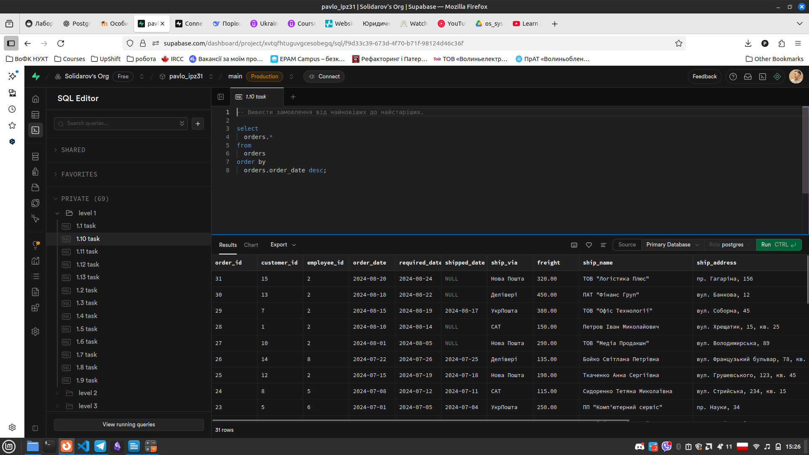
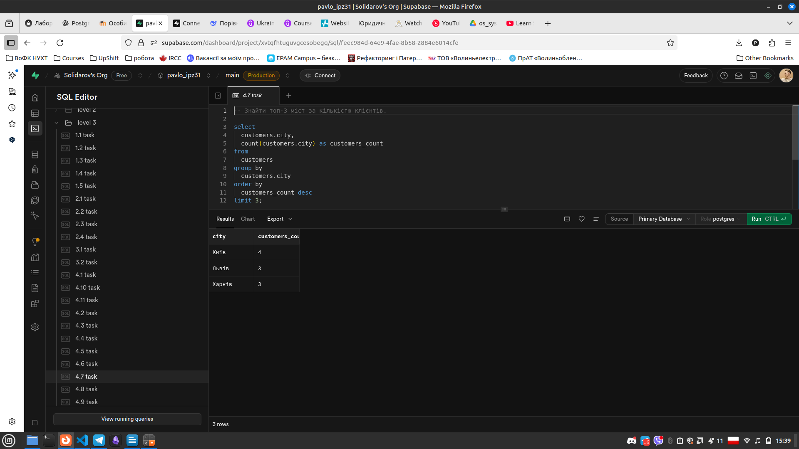

# Лабораторна робота 1. Робота з СУБД PostgreSQL та основи SQL

## Загальна інформація

**Здобувач освіти:** Нестерук Павло Романович
**Група:** ІПЗ-31
**Обраний рівень складності:** 3
**Посилання на проєкт:** [Посилання на Supabase проєкт](https://xvtqfhtuguvgcesobegq.supabase.co)

# Виконання завдань

## Перший рівень

### 1) Основні SELECT запити

#### 1.1) Отримати всі записи з таблиці customers
```sql
-- Отримати всі записи з таблиці customers.

select 
  *
from 
  customers;
```


#### 1.2) Вивести тільки назви товарів і їхні ціни з таблиці products

```sql
-- Вивести тільки назви товарів і їхні ціни з таблиці products.

select 
  products.product_name as "Назва продукту", 
  products.unit_price as "Ціна"
from 
  products;
```


#### 1.3) Показати контактні дані всіх співробітників (ім'я, прізвище, телефон, email).
```sql
-- Показати контактні дані всіх співробітників (ім'я, прізвище, телефон, email).

select 
  employees.first_name as "Імʼя", 
  employees.last_name as "Прізвище", 
  employees.phone as "Номер телефону", 
  employees.email as "E-mail"
from
  employees;
```


### 2) Прості умови WHERE

#### 2.1) Знайти всіх клієнтів з міста Київ
```sql
-- Знайти всіх клієнтів з міста Київ.

select
  customers.*
from 
  customers
where
  customers.city = 'Київ';
```


#### 2.2) Вивести товари, які коштують більше 25000 грн
```sql
-- Вивести товари, які коштують більше 25000 грн.

select
  products.*
from 
  products
where
  products.unit_price > 25000;
```


#### 2.3) Показати всі замовлення зі статусом 'delivered'
```sql
-- Показати всі замовлення зі статусом 'delivered'.

select
  orders.*
from 
  orders
where
  orders.order_status = 'delivered';
```


#### 2.4) Знайти співробітників, які працюють у відділі продажів (посада містить слово "продаж")
```sql
-- Знайти співробітників, які працюють у відділі продажів (посада містить слово "продаж").

select
  employees.*
from
  employees
where
  employees.title like '%продаж%';
```


### 3) Базове сортування ORDER BY

#### 3.1) Відсортувати товари за зростанням ціни
```sql
-- Відсортувати товари за зростанням ціни.

select
  products.unit_price, 
  products.*
from
  products
order by
  products.unit_price asc;
```


#### 3.2) Показати клієнтів в алфавітному порядку за іменем контактної особи
```sql
-- Показати клієнтів в алфавітному порядку за іменем контактної особи.

select
  customers.customer_id,
  customers.contact_name,
  customers.*
from
  customers
order by
  customers.contact_name asc;
```


#### 3.3) Вивести замовлення від найновіших до найстаріших
```sql
-- Вивести замовлення від найновіших до найстаріших.

select
  orders.*
from 
  orders
order by
  orders.order_date desc;
```




### 4) Обмеження результатів LIMIT

#### 4.1) Показати перші 10 найдорожчих товарів
```sql
-- Показати перші 10 найдорожчих товарів.

select
  products.*
from
  products
order by 
  products.unit_price desc
limit 10;
```


#### 4.2) Вивести 5 останніх замовлень (за датою)
```sql
-- Вивести 5 останніх замовлень (за датою).

select
  orders.*
from 
  orders
order by
  orders.order_date desc
limit 5;
```


#### 4.3) Отримати перших 8 клієнтів в алфавітному порядку
```sql
-- Отримати перших 8 клієнтів в алфавітному порядку

select
  customers.*
from 
  customers
order by
  customers.contact_name asc
limit 8;
```


## Другий рівень

### 1) Пошук за зразком з LIKE

#### 1.1) Знайти всіх клієнтів, чиї імена починаються на "Іван"
```sql
-- Знайти всіх клієнтів, чиї імена починаються на "Іван".
select
  customers.*
from 
  customers
where
  customers.contact_name like '% Іван %'; -- використовуємо пробіли, щоб позначити ім'я
```


#### 1.2) Вивести товари, в назві яких є слово "phone" або "телефон".

```sql
-- Вивести товари, в назві яких є слово "phone" або "телефон".

select
  products.*
from
  products
where
  products.product_name ilike '%phone%' 
    or -- використовуємо ilike для нечутливості регістру при пошуку
  products.product_name ilike '%телефон%';
```


#### 1.3) пошук клієнтів із кодом оператора +38 (050) або +38 (063)
```sql
-- пошук клієнтів із кодом оператора +38 (050) або +38 (063)

select
  customers.*
from
  customers
where
  customers.phone like '+38050%'
    or
  customers.phone like '+38063%';
```


#### 1.4) пошук області, чий код закінчується на V
```sql
-- пошук області, чий код закінчується на V

select
  regions.*
from
  regions
where
  regions.region_code ilike '%V';
```


#### 1.5) працівники, в яких 3ій символ 'в'
```sql
-- працівники, в яких 3ій символ 'в'

select
  employees.*
from
  employees
where
  employees.last_name like '__в%';
```


### 2) Логічні оператори AND, OR, NOT

#### 2.1) Знайти товари дорожчі за 15000 грн і дешевші за 50000 грн
```sql
-- Знайти товари дорожчі за 15000 грн і дешевші за 50000 грн.

select
  products.*
from
  products
where
  products.unit_price > 15000
  and
  products.unit_price < 50000;
```


#### 2.2) Вивести клієнтів з Києва або Львова, які є юридичними особами
```sql
-- Вивести клієнтів з Києва або Львова, які є юридичними особами.

select 
  customers.*
from 
  customers
where
  (customers.city = 'Київ'
  or
  customers.city = 'Львів')
  and
  customers.customer_type = 'company';
```


#### 2.3) Вивести клієнтів, в яких є компанія та їхні поштові індекси починаються на 61 та 79
```sql
-- Вивести клієнтів, в яких є компанія та їхні поштові індекси починаються на 61 та 79

select
  customers.*
from
  customers
where
  customers.company_name is not null
  and
  (customers.postal_code like '61%'
  or
  customers.postal_code like '79%');
```


#### 2.4) Вивести співробітників, які народжені в проміжку від 1980 та 1992 або співробітників з іменем Андрій
```sql
-- Вивести співробітників, які народжені в проміжку від 1980 та 1992 або співробітників з іменем Андрій

select
  employees.*
from 
  employees
where
  (employees.birth_date >= '1980-01-01'
  and
  employees.birth_date <= '1992-01-01')
  or
  employees.first_name = 'Андрій';
```


#### 2.5) Вивести доставлені посилки, що перевозяться всіма компаніями окрім САТ та Делівері
```sql
-- Вивести доставлені посилки, що перевозяться всіма компаніями окрім САТ та Делівері

select
  orders.*
from
  orders
where
  orders.ship_via != 'САТ'
  and
  orders.ship_via != 'Делівері'
  and
  orders.order_status = 'delivered';
```


#### 2.6) Вивести товари, кількість яких на складі знаходиться в проміжку від 6 до 21 включно та в ціновій категорії 12000 - 21000грн
```sql
-- Вивести товари, кількість яких на складі знаходиться в проміжку від 6 до 21 включно та в ціновій категорії 12000 - 21000грн

select
  products.*
from
  products
where
  (products.units_in_stock > 6
  and
  products.units_in_stock <= 21)
  and
  (products.unit_price > 12000
  and
  products.unit_price <= 21000);
```


### 3) Оператори IN, BETWEEN, IS NULL

#### 3.1) Вивести клієнтів з міст Київ, Харків, Одеса, Дніпро
```sql
-- Вивести клієнтів із Києва, Харкова, Одеси або Дніпра

select
  customers.*
from 
  customers
where
  customers.city in ('Київ', 'Харків', 'Одеса', 'Дніпро')
```


#### 3.2) вивести товари в діапазоні 10000 та 30000 грн
```sql
-- вивести товари в діапазоні 10000 та 30000 грн

select
  products.*
from
  products
where
  products.unit_price between 10000 and 30000;
```


#### 3.3) товари, що належать до категорій "Смартфони та телефони" та "Ігрові консолі та ігри"
```sql
-- товари, що належать до категорій "Смартфони та телефони" та "Ігрові консолі та ігри"

select
  products.*
from
  products
join
  categories on products.category_id = categories.category_id
where
  categories.category_name in ('Смартфони та телефони', 'Ігрові консолі та ігри');
```


#### 3.4) постачальники, що знаходяться у Києві, Львові та Харкові
```sql
-- постачальники, що знаходяться у Києві, Львові та Харкові

select
  suppliers.*
from
  suppliers
where
  suppliers.city in ('Київ', 'Львів', 'Харків');
```


#### 3.5) товари з ціною в діапазоні від 5000 до 15000
```sql
-- товари з ціною в діапазоні від 5000 до 15000

select
  p.*
from
  products as p
where
  p.unit_price between 5000 and 15000
  and
  p.units_in_stock > 12;
```


#### 3.6) замовлення, необхідна дата яких знаходиться між 1 січня та 31 березня 2024 року
```sql
-- замовлення, необхідна дата яких знаходиться між 1 січня та 31 березня 2024 року

select
  orders.*
from
  orders
where
  orders.required_date between '2024-01-01' and '2024-03-01'
order by
  orders.required_date desc;
```


#### 3.7) знайти постачальників, в яких не вказана електронна адреса
```sql
-- знайти постачальників, в яких не вказана електронна адреса

select
  suppliers.*
from
  suppliers
where
  suppliers.email is null;
```


#### 3.8) співробітники, в яких вкзано по-батькові
```sql
-- співробітники, в яких вкзано по-батькові

select
  employees.*
from
  employees
where
  employees.middle_name is not null;
```


#### 3.9) товари, опис яких містить слово новий та ціна > 10000 грн

```sql
-- товари, опис яких містить слово новий та ціна > 10000 грн

select
  products.*
from
  products
where
  products.description ilike '%новий%'
  and
  products.unit_price > 10_000;
```


#### 3.10) замовлення зроблені клієнтами з Києва або Львова, в період між 1 квітня та 30 червня
```sql
-- замовлення зроблені клієнтами з Києва або Львова, в період між 1 квітня та 30 червня

select
  orders.*
from
  orders
join
  customers on orders.customer_id = customers.customer_id
where
  customers.city in ('Київ', 'Львів')
  and
  orders.order_date between '2024-04-01' and '2024-06-30';
```


### 4) Комбінування умов

#### 4.1) вибрати співробітників, у яких посада містить слово «менеджер» і які працюють у регіонах KV, LV, KH.
```sql
-- вибрати співробітників, у яких посада містить слово «менеджер» і які працюють у регіонах KV, LV, KH.

select
  employees.*
from
  employees
join
  regions on employees.region_id = regions.region_id
where
  employees.title ilike '%менеджер%'
  and
  regions.region_code in ('KV', 'LV', 'KH');
```


#### 4.2) клієнти у яких немає електронної пошти, та проживають у Харкові
```sql
-- клієнти у яких немає електронної пошти, та проживають у Харкові

select
  customers.*
from
  customers
where
  customers.email is null
  and
  customers.city = 'Харків';
```


#### 4.3) товари з ціною між 2000 та 8000 в категоріях "аксесуари" та "дім"
```sql
-- товари з ціною між 2000 та 8000 в категоріях "аксесуари" та "дім"

select
  products.*
from
  products
join
  categories on products.category_id = categories.category_id
where
  products.unit_price between 2000 and 8000
  and 
  (categories.category_name ilike '%аксесуари%'
  or
  categories.category_name ilike '%дім%');
```


#### 4.4) вибрати товари, відсортовані спочатку за категорією, потім за ціною у зростанні
```sql
--вибрати товари, відсортовані спочатку за категорією, потім за ціною у зростанні

select
  products.*
from
  products
order by
  products.category_id, 
  products.unit_price asc;
```


#### 4.5) вибрати клієнтів, відсортованих за містом, а потім за прізвищем
```sql
-- вибрати клієнтів, відсортованих за містом, а потім за прізвищем

select
  customers.*
from 
  customers
order by
  customers.city desc,
  customers.contact_name asc;
```


### 5) Складне сортування та пагінація

#### 5.1) вибрати замовлення, відсортовані за датою оформлення, а всередині однієї дати — за сумою замовлення
```sql
-- вибрати замовлення, відсортовані за датою оформлення, а всередині однієї дати — за сумою замовлення

select
  sum(order_items.unit_price * order_items.quantity) as order_sum, -- шукаємо загальну ціну замовлення
  orders.*
from
  orders
join
  order_items on orders.order_id = order_items.order_id -- приєднуємо таблицю із товарами, що замовили
group by
  orders.order_id -- групуємо дані за номером замовлення, це потрібно для сумування ціни замовлення
order by
  orders.order_date desc,
  order_sum asc;
```


#### 5.2) Показати 5 перших клієнтів, пропустивши перші 10 (сторінка №3)
```sql
-- Показати 5 перших клієнтів, пропустивши перші 10 (сторінка №3)

select
  customers.*
from
  customers
limit 5
offset 10;
```


#### 5.3) Вивести 5 товарів, починаючи з 11-го за порядком
```sql
-- Вивести 5 товарів, починаючи з 11-го за порядком

select
  products.*
from
  products
where
  products.unit_price between 12000 and 40000
order by
  products.unit_price desc
limit 5
offset 10;
```


## Третій рівень

### 1) Складні комбінації LIKE з логічними операторами

#### 1.1) Знайти товари, в назві яких є "Samsung" або "Apple", але немає слова "чохол"
```sql
-- Знайти товари, в назві яких є "Samsung" або "Apple", але немає слова "чохол".

select
  products.*
from
  products
where
  (products.product_name ilike '%samsung%'
  or
  products.product_name ilike '%apple%')
  and
  products.product_name not ilike '%чохол%';
```


#### 1.2) Знайти клієнтів, у чиїх прізвищах є "енко" або "ук", але яких не звати "Андрій"

```sql
-- Знайти клієнтів, у чиїх прізвищах є "енко" або "ук", але яких не звати "Андрій".

select
  customers.*
from
  customers
where
  (
    customers.contact_name ilike '%енко%'
    or
    customers.contact_name ilike '%ук%'
  )
  and
  customers.contact_name not ilike '%Андрій%';

```


#### 1.3) Вибрати співробітників, у чиї посади не мають слова "менеджер" і при цьому вони не старші 35 років.
```sql
-- Вибрати співробітників, у чиї посади не мають слова "менеджер" і при цьому вони не старші 35 років.

select
  employees.*
from
  employees
where
  employees.title not ilike '%менеджер%'
  and
  employees.birth_date > now() - interval '35 year'; -- віднімаємо від теперішньої дати 35 років та перевіряємо чи поле більше за цю дату
```


#### 1.4) Знайти постачальників,в яких тип компанії це ПП та які є їхніми власниками 
```sql
-- Знайти постачальників,в яких тип компанії це ПП та які є їхніми власниками

select
  suppliers.*
from
  suppliers
where
  suppliers.company_name like 'ПП%'
  and
  suppliers.contact_title like 'Власник';
```


#### 1.5) знайти всю техніку Apple, яка коштує більше 30 000
```sql
-- знайти всю техніку Apple, яка коштує більше 30 000

select
  products.*
from
  products
where
  (
    products.product_name like 'i%'
    or
    products.product_name like 'Mac%'
    or
    products.product_name ilike '%apple%'
  )
  and
  products.unit_price > 30_000;
```


### 2) Вкладені логічні умови

#### 2.1) Знайти товари дорожчі 20000 грн (категорії 1 або 2) АБО товари дешевші 5000 грн будь-якої категорії
```sql
-- Знайти товари дорожчі 20000 грн (категорії 1 або 2) АБО товари дешевші 5000 грн будь-якої категорії

select
  products.*
from
  products
where
  (
    products.unit_price > 20000
    and
    products.category_id in (1, 2)
  )
  or
  products.unit_price < 5000
order by
  products.unit_price;
```


#### 2.2) Вибрати товари, які належать до категорії "Ноутбуки" і мають ціну між 15000 і 30000 грн, АБО товари з категорії "Смартфони", але тільки якщо їхня кількість на складі менше 10
```sql
-- Вибрати товари, які належать до категорії "Ноутбуки" і мають ціну між 15000 і 30000 грн, АБО товари з категорії "Смартфони", але тільки якщо їхня кількість на складі менше 10

select
  products.*
from
  products
join
  categories on products.category_id = categories.category_id
where
  (
    categories.category_name ilike '%Ноутбуки%'
    and
    products.unit_price between 15_000 and 30_000
  )
  or
  (
    categories.category_name ilike '%Смартфони%'
    and
    products.units_in_stock < 10
  );
```


#### 2.3) Знайти співробітників, які працюють у відділі продажів і мають стаж більше 3 років, АБО менеджерів із зарплатою від 20000 до 25000.
```sql
-- Знайти співробітників, які працюють у відділі продажів і мають стаж більше 3 років, АБО менеджерів із зарплатою від 20000 до 25000.

select
  employees.*
from
  employees
where
  (
    employees.title ilike '%продаж%'
    and
    employees.hire_date < now() - interval '3 year' -- визначаємо стаж в 3 роки та більше
  )
  or
  (
    employees.title ilike '%менеджер%'
    and
    employees.salary between 20_000 and 25_000
  );
```


#### 2.4) Товари, що є у категорії 3, але або їх кількість < 15, або ціна між 10000 і 15000
```sql
-- Товари, що є у категорії 3, але або їх кількість < 15, або ціна між 10000 і 15000

select
  products.*
from
  products
where
  products.category_id = 3
  and
  (
    products.units_in_stock < 15
    or
    products.unit_price between 10_000 and 15_000
  );
```


### 3) Комплексні аналітичні запити

#### 3.1) Створити звіт товарів з 5+ різними умовами фільтрації одночасно
```sql
-- Ціна товару від 5 000 до 30 000 грн.
-- Кількість на складі більше 10 одиниць.
-- Категорія належить до 2, 3 або 5.
-- У назві товару є слово «Pro».
-- Ще виробляється.

select
  products.*
from
  products
where
  products.unit_price between 5_000 and 30_000
  and
  products.units_in_stock > 10
  and 
  products.category_id in (2, 3, 8)
  and
  products.product_name ilike '%Pro%'
  and
  products.discontinued is false;
```


#### 3.2) Написати запит для аналізу клієнтської бази з множинними критеріями відбору
```sql
-- Вказано посаду.
-- Місто проживання — Київ, Львів або Одеса.
-- Адреса електронної пошти закінчується на «.com».
-- Вид компанії - ТОВ
-- Або контактна особа - Максим

select
  customers.*
from
  customers
where
  (
    customers.contact_title is not null
    and
    customers.city in ('Київ', 'Львів', 'Одеса')
    and
    (
      customers.email like '%.com' 
      or 
      customers.email like '%.ua'
    )
    and
    customers.company_name ilike 'тов%'
  )
  or
  customers.contact_name ilike '%Максим%';

```


### 4) Дослідження даних та пошук закономірностей

#### 4.1) Знайти кількість товарів з ціною до 5000 грн (бюджетний сегмент)
```sql
-- Знайти кількість товарів з ціною до 5000 грн (бюджетний сегмент).

select
  count(products.product_id) -- підраховує кількість товарів до 5000 грн
from
  products
where
  products.unit_price <= 5_000;
```


#### 4.2) Знайти середню ціну товарів у діапазоні від 5000 до 15000 грн (середній сегмент)
```sql
-- Знайти середню ціну товарів у діапазоні від 5000 до 15000 грн (середній сегмент).

select
  round(avg(products.unit_price), 2) as avg_mid_price -- розраховуємо середню ціну та округлюємо до 2 знаків після коми
from
  products
where
  products.unit_price between 5_000 and 15_000;
```


#### 4.3) Визначити найдорожчий товар серед товарів з ціною понад 15000 грн (преміум-сегмент)
```sql
-- Визначити найдорожчий товар серед товарів з ціною понад 15000 грн (преміум-сегмент).

select
  products.*
from
  products
where
  products.unit_price > 15_000
order by
  products.unit_price desc
limit 1;
```


#### 4.4) Порахувати загальну суму вартості товарів у кожному ціновому сегменті
```sql
-- Порахувати загальну суму вартості товарів у кожному ціновому сегменті.

select
  case -- визначаємо ціновий сегмент для кожного товару 
    when products.unit_price <= 5_000 then 'low'
    when products.unit_price <= 15_000 then 'mid'
    when products.unit_price > 15_000 then 'high'
  end as budget_sector,
  sum(products.unit_price) as sector_sum -- сумуємо ціну всіх товарів певного цінового сегменту 
from
  products
group by
  budget_sector -- групуємо за ціновим сегментом
order by
  sector_sum -- впорядковуємо результат за ціною (за зростанням)
```


#### 4.5) Визначити кількість клієнтів у Києві
```sql
-- Визначити кількість клієнтів у Києві

select
  count(customers.customer_id) as kyiv_customers
from
  customers
where
  customers.city = 'Київ'
```


#### 4.6) Порахувати клієнтів у Львові та Одесі й порівняти між собою
```sql
-- Порахувати клієнтів у Львові та Одесі й порівняти між собою.

with lviv_customers as ( -- використовуємо CTE (Common Table Expression) та визначаємо кількість клієнтів у Львові
  select 
    count(customers.city) as lviv_count
  from 
    customers 
  where 
    customers.city = 'Львів'
),
odesa_customers as ( -- використовуємо CTE (Common Table Expression) та визначаємо кількість клієнтів в Одесі
  select 
    count(customers.city) as odesa_count
  from 
    customers 
  where 
    customers.city = 'Одеса'
)

select
  lviv_customers.lviv_count,
  odesa_customers.odesa_count,
  case -- порівнюємо результати обох CTE таблиць
    when lviv_customers.lviv_count > odesa_customers.odesa_count then 'Більше у Львові'
    when lviv_customers.lviv_count < odesa_customers.odesa_count then 'Більше в Одесі'
    else 'Однаково в обох'
  end as comparison
from
  lviv_customers,
  odesa_customers
```


#### 4.7) Знайти топ-3 міст за кількістю клієнтів
```sql
-- Знайти топ-3 міст за кількістю клієнтів.

select
  customers.city,
  count(customers.city) as customers_count
from
  customers
group by
  customers.city
order by
  customers_count desc
limit 3;
```




#### 4.8) Проаналізувати середню кількість замовлень клієнтів у різних регіонах
```sql
-- Проаналізувати середню кількість замовлень клієнтів у різних регіонах.

with customers_orders as( -- CTE для визначення кількості замовлень для кожного клієнта
  select
    customers.customer_id,
    count(orders.customer_id) as ord_count 
  from
    customers
  join 
    orders on customers.customer_id = orders.customer_id
  group by
    customers.customer_id
)


select
  customers.city,
  round(avg(customers_orders.ord_count), 2) as avg_order_count
from
  customers_orders -- беремо результат таблиці СТЕ як основний
join
  customers on customers.customer_id = customers_orders.customer_id
group by
  customers.city -- групуємо користувачів з кількістю замовлень за містом проживання
```


#### 4.9) Визначити, скільки замовлень робиться у робочі дні та у вихідні
```sql
-- Визначити, скільки замовлень робиться у робочі дні та у вихідні

with weekdays as ( -- створюємо СТЕ що рахує кількість замовлень в робочі дні (пн - пт)
  select
    count(orders.order_id) as weekdays_orders
  from 
    orders
  where
    extract (dow from orders.order_date) between 1 and 5 -- шукаємо дати, де dow (day of week) від пн до пт
), 

weekends as ( -- створюємо СТЕ що рахує кількість замовлень у вихідні дні (сб-нд)
  select
    count(orders.order_id) as weekends_orders
  from 
    orders
  where
    extract (dow from orders.order_date) between 6 and 7  -- шукаємо дати, де dow (day of week) від сб до нд
)

select
  weekdays.weekdays_orders,
  weekends.weekends_orders
from
  weekdays,
  weekends
```


#### 4.10) Визначити кількість клієнтів у Києві
```sql
-- Знайти розподіл замовлень по кварталах року (Q1, Q2, Q3, Q4).

with orders_quarter as ( -- СТЕ для маркування кожного замовлення, згідно з його кварталом
  select
    case
      when extract(quarter from orders.order_date) = 1 then 'Q1'
      when extract(quarter from orders.order_date) = 2 then 'Q2'
      when extract(quarter from orders.order_date) = 3 then 'Q3'
      when extract(quarter from orders.order_date) = 4 then 'Q4'
    end as quarter
  from 
    orders
)

select
  orders_quarter.quarter,
  count(orders_quarter.quarter) -- рахуємо кількість замовлень в першому кварталі
from 
  orders_quarter
group by
  orders_quarter.quarter -- групуємо по маркування, що зробили раніше в СТЕ
order by
  orders_quarter.quarter asc
```


#### 4.11) Порівняти кількість замовлень у поточному році з попереднім
```sql
-- Порівняти кількість замовлень у поточному році з попереднім

select
  extract(year from orders.order_date) as order_year, -- дістаємо з дати рік
  count(orders.order_date)
from
  orders
group by
  order_year -- групуємо по полю, що має рік замовлення
```


### 5) Креативні завдання

#### 5.1) -- Замовлення, що складаються з унікальних товарів
```sql
-- Замовлення, що складаються з унікальних товарів

WITH product_order_count AS (
    SELECT 
        product_id,
        COUNT(DISTINCT order_id) AS order_count
    FROM 
      order_items
    GROUP BY 
      product_id
),

unique_products AS (
    SELECT 
      product_id
    FROM 
      product_order_count
    WHERE 
      order_count = 1
)

SELECT 
  DISTINCT oi.order_id
FROM 
  order_items oi
JOIN 
  unique_products up ON oi.product_id = up.product_id;

```


#### 5.2) Піковий сезон (місяць з найбільшою кількістю замовлень у кожному році)
```sql
-- Піковий сезон (місяць з найбільшою кількістю замовлень у кожному році)

WITH monthly_orders AS (
    SELECT 
        EXTRACT(YEAR FROM order_date) AS order_year,
        EXTRACT(MONTH FROM order_date) AS order_month,
        COUNT(order_id) AS orders_count
    FROM orders
    GROUP BY order_year, order_month
),
ranked AS (
    SELECT 
        order_year,
        order_month,
        orders_count,
        RANK() OVER (PARTITION BY order_year ORDER BY orders_count DESC) AS rnk
    FROM monthly_orders
)
SELECT order_year, order_month, orders_count
FROM ranked
WHERE rnk = 1;
```


#### 5.3) Знайти в кожній категорії товар із найвищою ціною та з найнижчою ціною, вивести їх разом для порівняння
```sql
-- Знайти в кожній категорії товар із найвищою ціною та з найнижчою ціною, вивести їх разом для порівняння

SELECT 
    c.category_name,
    p_max.product_name AS most_expensive,
    p_max.unit_price AS max_price,
    p_min.product_name AS cheapest,
    p_min.unit_price AS min_price
FROM categories c
JOIN LATERAL (
    SELECT product_name, unit_price
    FROM products
    WHERE products.category_id = c.category_id
    ORDER BY unit_price DESC
    LIMIT 1
) p_max ON true
JOIN LATERAL (
    SELECT product_name, unit_price
    FROM products
    WHERE products.category_id = c.category_id
    ORDER BY unit_price ASC
    LIMIT 1
) p_min ON true;
```


#### 5.4) Рівень активності клієнтів
```sql
-- Рівень активності клієнтів

WITH customer_orders AS (
    SELECT 
        customer_id,
        COUNT(order_id) AS order_count
    FROM 
      orders
    GROUP BY 
      customer_id
)
SELECT 
    c.customer_id,
    c.contact_name,
    c.city,
    co.order_count,
    CASE
        WHEN co.order_count < 3 THEN 'рідкісний'
        WHEN co.order_count BETWEEN 3 AND 10 THEN 'середній'
        ELSE 'активний'
    END AS activity_level
FROM 
  customers c
JOIN 
  customer_orders co ON c.customer_id = co.customer_id;
```


#### 5.5) Клієнти, у яких кількість замовлень > середньої кількості замовлень по всіх клієнтах
```sql
-- Клієнти, у яких кількість замовлень > середньої кількості замовлень по всіх клієнтах

WITH customer_orders AS (
    SELECT 
        customer_id,
        COUNT(order_id) AS order_count
    FROM orders
    GROUP BY 
        customer_id
),

avg_orders AS (
    SELECT 
        AVG(order_count) AS avg_count 
    FROM 
        customer_orders
)

SELECT 
    c.customer_id,
    c.contact_name,
    c.city,
    co.order_count
FROM 
    customers c
JOIN 
    customer_orders co ON c.customer_id = co.customer_id
JOIN 
    avg_orders a ON co.order_count > a.avg_count
ORDER BY 
    co.order_count DESC;
```


## Висновки

**Самооцінка**: 5

**Обгрунтування**: Всі завдання та звіт було виконано згідно всіх можливих вимог.
