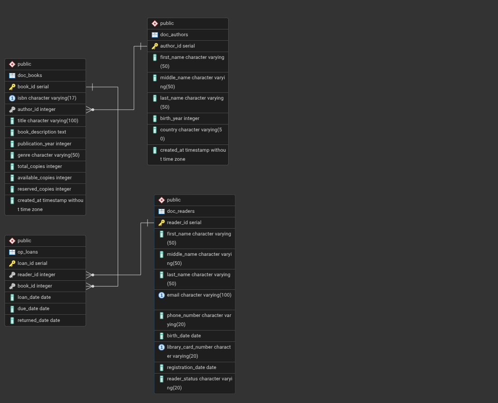
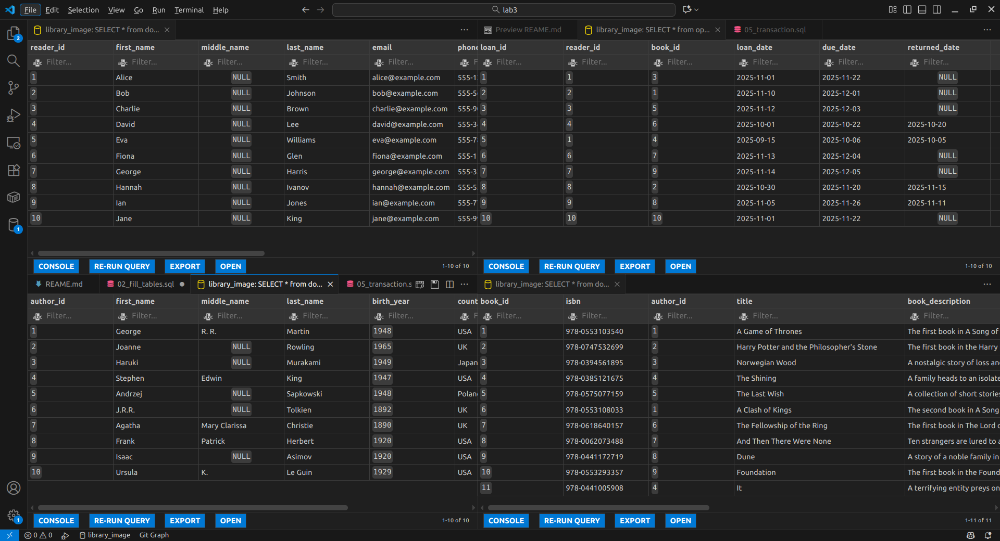
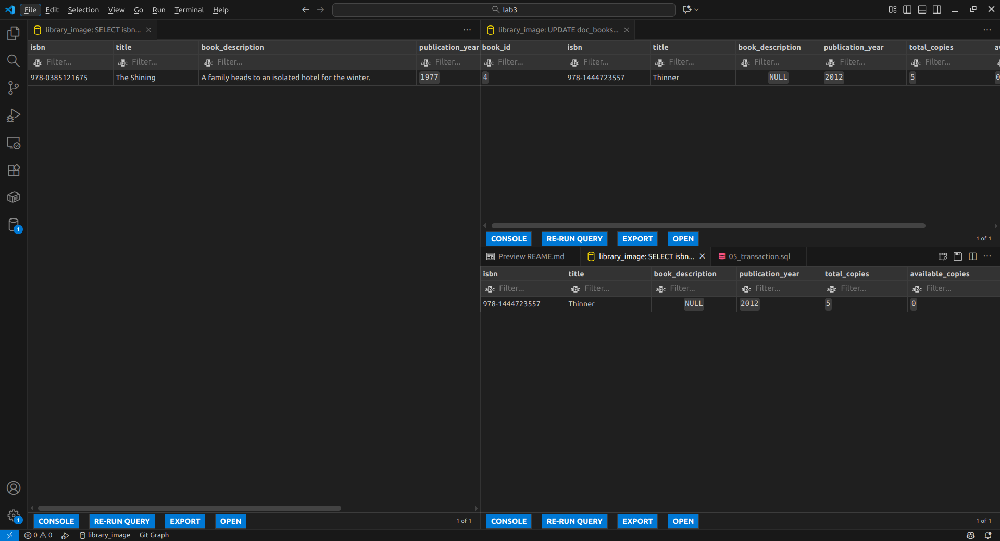
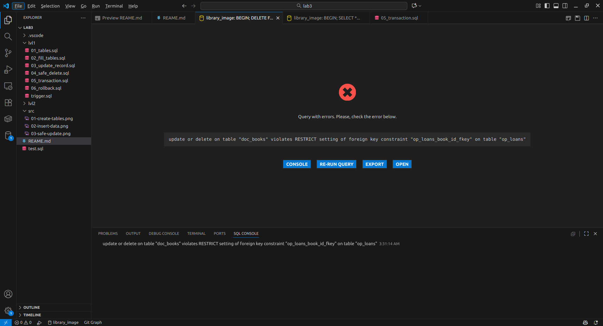
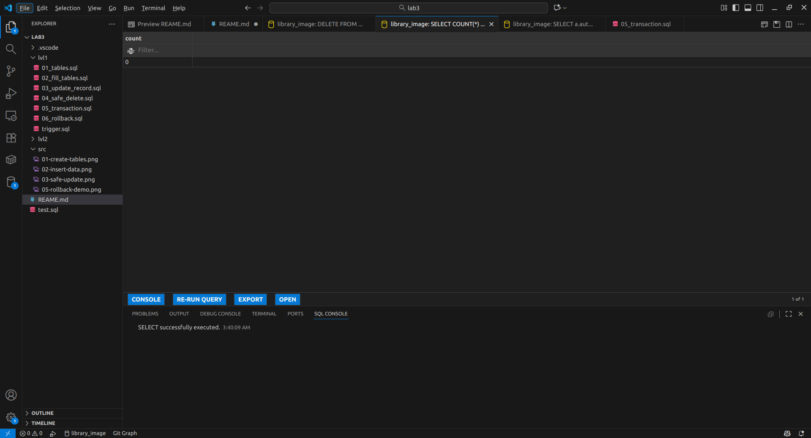
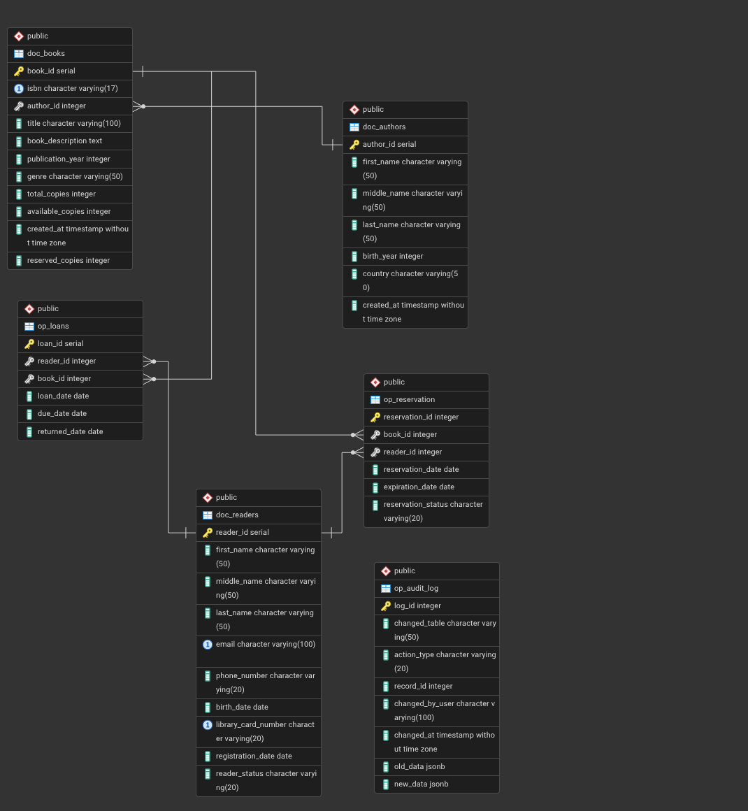
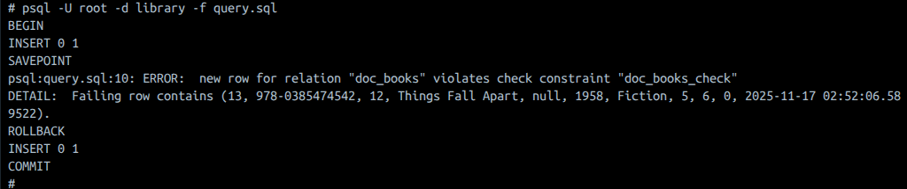
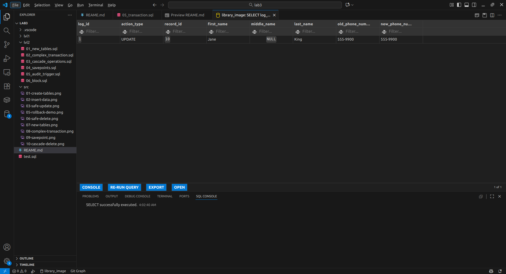
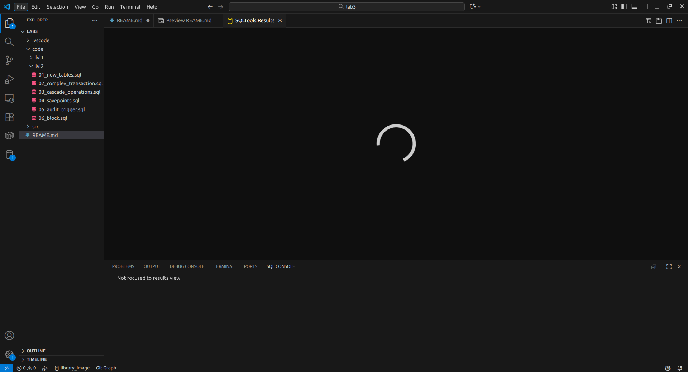

# Звіт з лабораторної роботи 3. Модифікація даних та транзакції

**Виконав:** Нестерук Павло
**Група:** ІПЗ-31
**Дата виконання:** 17 жовтня 2025 року
**Варіант:** Система управління бібліотекою

## Мета роботи

Здобути практичні навички безпечної модифікації даних у реляційних базах даних, опанувати механізми транзакцій для забезпечення цілісності даних, навчитися працювати з обмеженнями цілісності та каскадними операціями при зміні взаємопов'язаних записів.

## Виконання роботи

### Рівень 1. Базові операції модифікації

#### Крок 1. Створення структури бази даних

Створено базу даних для системи управління бібліотекою з чотирма основними таблицями.

```sql
CREATE DATABASE library;
```

**Таблиця авторів з обмеженнями:**

```sql
CREATE TABLE doc_authors(
    author_id SERIAL PRIMARY KEY,
    first_name VARCHAR(50) NOT NULL,
    middle_name VARCHAR(50),
    last_name VARCHAR(50) NOT NULL,
    birth_year INTEGER CHECK (birth_year <= EXTRACT(YEAR FROM CURRENT_DATE)),
    country VARCHAR(50),
    created_at TIMESTAMP DEFAULT CURRENT_TIMESTAMP
);
```

Обмеження таблиці authors:
- PRIMARY KEY на author_id забезпечує унікальність кожного автора.
- NOT NULL на іменах запобігає створенню анонімних авторів.
- CHECK на birth_year обмежує введення майбутньої дати.

**Таблиця книг з розширеними обмеженнями:**

```sql
CREATE TABLE doc_books(
    book_id SERIAL PRIMARY KEY,
    isbn VARCHAR(17) UNIQUE NOT NULL,
    author_id INTEGER NOT NULL,
    title VARCHAR(100) NOT NULL,
    book_description TEXT,
    publication_year INTEGER CHECK (publication_year >= 1800 AND publication_year <= EXTRACT(YEAR FROM CURRENT_DATE)),
    genre VARCHAR(50),
    total_copies INTEGER DEFAULT 1 CHECK (total_copies >= 0),
    available_copies INTEGER DEFAULT 1 CHECK (available_copies >= 0),
    reserved_copies INTEGER DEFAULT 0 CHECK (reserved_copies >= 0),
    created_at TIMESTAMP DEFAULT CURRENT_TIMESTAMP,   

    FOREIGN KEY (author_id) REFERENCES doc_authors(author_id) ON DELETE RESTRICT,
    CHECK (available_copies <= total_copies AND reserved_copies <= total_copies)
);
```

Ключові обмеження:
- UNIQUE на isbn гарантує відсутність дублікатів книг.
- FOREIGN KEY з ON DELETE RESTRICT запобігає видаленню авторів, у яких є книги.
- CHECK для available_copies <= total_copies та reserved_copies <= total_copies забезпечує логічну консистентність.
- CHECK для publication_year не дозволяє записувати занадто старі книжки або вводити майбутню дату
- CHECK для total_copies, available_copies та reserved_copies не дозволяє вводити кількість менше 0

**Таблиця читачів:**

```sql
CREATE TABLE doc_readers(
    reader_id SERIAL PRIMARY KEY,
    first_name VARCHAR(50) NOT NULL,
    middle_name VARCHAR(50),
    last_name VARCHAR(50) NOT NULL,
    email VARCHAR(100) UNIQUE NOT NULL,
    phone_number VARCHAR(20),
    birth_date DATE CHECK (birth_date >= '2019-01-01'),
    library_card_number VARCHAR(20) UNIQUE NOT NULL,
    registration_date DATE DEFAULT CURRENT_DATE, 
    reader_status VARCHAR(20) DEFAULT 'Active' CHECK (reader_status in ('Active', 'Blocked', 'Inactive'))
);
```
Ключові обмеження:
- CHECK для birth_date не дозволяє записувати читачів менше 6 років.

**Таблиця видач:**

```sql
CREATE TABLE op_loans(
    loan_id SERIAL PRIMARY KEY,
    reader_id INTEGER NOT NULL,
    book_id INTEGER NOT NULL,
    loan_date DATE DEFAULT CURRENT_DATE,
    due_date DATE NOT NULL,
    returned_date DATE,

    FOREIGN KEY (reader_id) REFERENCES doc_readers(reader_id) ON DELETE RESTRICT,
    FOREIGN KEY (book_id) REFERENCES doc_books(book_id) ON DELETE RESTRICT,

    CHECK (due_date > loan_date),
    CHECK (returned_date IS NULL OR returned_date >= loan_date) 
);
```

**Результат створення структури:**



#### Крок 2. Додавання тестових даних

Виконано вставку початкових даних у всі створені таблиці.

**Додавання авторів:**

```sql
INSERT INTO doc_authors (first_name, middle_name, last_name, birth_year, country) VALUES
('George', 'R. R.', 'Martin', 1948, 'USA'),
('Joanne', NULL, 'Rowling', 1965, 'UK'),
('Haruki', NULL, 'Murakami', 1949, 'Japan'),
('Stephen', 'Edwin', 'King', 1947, 'USA'),
('Andrzej', NULL, 'Sapkowski', 1948, 'Poland'),
('J.R.R.', NULL, 'Tolkien', 1892, 'UK'),
('Agatha', 'Mary Clarissa', 'Christie', 1890, 'UK'),
('Frank', 'Patrick', 'Herbert', 1920, 'USA'),
('Isaac', NULL, 'Asimov', 1920, 'USA'),
('Ursula', 'K.', 'Le Guin', 1929, 'USA');
```

**Результат вставки:**

```
INSERT 0 10
```

**Перевірка доданих авторів:**

```sql
SELECT * FROM doc_authors ORDER BY birth_year;
```
|author_id|first_name|middle_name  |last_name|birth_year|country|created_at                |
|---------|----------|-------------|---------|----------|-------|--------------------------|
|7        |Agatha    |Mary Clarissa|Christie |1890      |UK     |2025-11-15 21:51:33.826249|
|6        |J.R.R.    |             |Tolkien  |1892      |UK     |2025-11-15 21:51:33.826249|
|9        |Isaac     |             |Asimov   |1920      |USA    |2025-11-15 21:51:33.826249|
|8        |Frank     |Patrick      |Herbert  |1920      |USA    |2025-11-15 21:51:33.826249|
|33       |Chinua    |             |Achebe   |1930      |Nigeria|2025-11-16 22:32:24.662385|
|4        |Stephen   |Edwin        |King     |1947      |USA    |2025-11-15 21:24:40.453597|
|5        |Andrzej   |             |Sapkowski|1948      |Poland |2025-11-15 21:24:40.453597|
|1        |George    |R. R.        |Martin   |1948      |USA    |2025-11-15 21:24:40.453597|
|3        |Haruki    |             |Murakami |1949      |Japan  |2025-11-15 21:24:40.453597|
|2        |Joanne    |             |Rowling  |1965      |UK     |2025-11-15 21:24:40.453597|


**Додавання книг:**

```sql
INSERT INTO doc_books (isbn, author_id, title, book_description, publication_year, genre, total_copies, available_copies) VALUES
('978-0553103540', 1, 'A Game of Thrones', 'The first book in A Song of Ice and Fire.', 1996, 'Fantasy', 10, 9),
('978-0747532699', 2, 'Harry Potter and the Philosopher''s Stone', 'The first book in the Harry Potter series.', 1997, 'Fantasy', 15, 15),
('978-0394561895', 3, 'Norwegian Wood', 'A nostalgic story of loss and sexuality.', 1987, 'Fiction', 5, 4),
('978-0385121675', 4, 'The Shining', 'A family heads to an isolated hotel for the winter.', 1977, 'Horror', 7, 7),
('978-0575077159', 5, 'The Last Wish', 'A collection of short stories in The Witcher series.', 1993, 'Fantasy', 8, 7),
('978-0553108033', 1, 'A Clash of Kings', 'The second book in A Song of Ice and Fire.', 1998, 'Fantasy', 10, 10),
('978-0618640157', 6, 'The Fellowship of the Ring', 'The first book in The Lord of the Rings.', 1954, 'Fantasy', 12, 11),
('978-0062073488', 7, 'And Then There Were None', 'Ten strangers are lured to an isolated island.', 1939, 'Mystery', 9, 9),
('978-0441172719', 8, 'Dune', 'A story of a noble family in a distant future.', 1965, 'Sci-Fi', 10, 8),
('978-0553293357', 9, 'Foundation', 'The first book in the Foundation series.', 1951, 'Sci-Fi', 6, 6),
('978-0441005908', 4, 'It', 'A terrifying entity preys on the children of Derry.', 1986, 'Horror', 5, 5);
```

**Результат вставки:**

```
INSERT 0 11
```

**Перевірка доданих книг:**

```sql
SELECT * FROM doc_books ORDER BY publication_year;
```
|book_id|isbn   |author_id    |title    |book_description|publication_year|genre                     |total_copies|available_copies|created_at                |reserved_copies|
|-------|-------|-------------|---------|----------------|----------------|--------------------------|------------|----------------|--------------------------|---------------|
|8      |978-0062073488|7            |And Then There Were None|Ten strangers are lured to an isolated island.|1939            |Mystery                   |9           |9               |2025-11-15 21:52:24.931702|0              |
|10     |978-0553293357|9            |Foundation|The first book in the Foundation series.|1951            |Sci-Fi                    |6           |6               |2025-11-15 21:52:24.931702|0              |
|7      |978-0618640157|6            |The Fellowship of the Ring|The first book in The Lord of the Rings.|1954            |Fantasy                   |12          |11              |2025-11-15 21:52:24.931702|0              |
|30     |978-0385474542|33           |Things Fall Apart|                |1958            |Fiction                   |5           |5               |2025-11-16 22:32:24.662385|0              |
|9      |978-0441172719|8            |Dune     |A story of a noble family in a distant future.|1965            |Sci-Fi                    |10          |8               |2025-11-15 21:52:24.931702|0              |
|11     |978-0441005908|4            |It       |A terrifying entity preys on the children of Derry.|1986            |Horror                    |5           |5               |2025-11-15 21:52:24.931702|0              |
|3      |978-0394561895|3            |Norwegian Wood|A nostalgic story of loss and sexuality.|1987            |Fiction                   |5           |4               |2025-11-15 21:26:17.07362 |0              |
|5      |978-0575077159|5            |The Last Wish|A collection of short stories in The Witcher series.|1993            |Fantasy                   |8           |7               |2025-11-15 21:26:17.07362 |0              |
|1      |978-0553103540|1            |A Game of Thrones|The first book in A Song of Ice and Fire.|1996            |Fantasy                   |10          |9               |2025-11-15 21:26:17.07362 |1              |
|2      |978-0747532699|2            |Harry Potter and the Philosopher's Stone|The first book in the Harry Potter series.|1997            |Fantasy                   |15          |15              |2025-11-15 21:26:17.07362 |0              |
|6      |978-0553108033|1            |A Clash of Kings|The second book in A Song of Ice and Fire.|1998            |Fantasy                   |10          |10              |2025-11-15 21:26:17.07362 |0              |
|4      |978-1444723557|4            |Thinner  |                |2012            |Horror                    |5           |0               |2025-11-15 21:26:17.07362 |0              |


**Додавання читачів:**

```sql
INSERT INTO doc_readers (first_name, last_name, email, phone_number, birth_date, library_card_number) VALUES
('Alice', 'Smith', 'alice@example.com', '555-1234', '2019-05-10', 'LCARD_001'),
('Bob', 'Johnson', 'bob@example.com', '555-5678', '2020-02-15', 'LCARD_002'),
('Charlie', 'Brown', 'charlie@example.com', '555-9012', '2019-11-30', 'LCARD_003'),
('David', 'Lee', 'david@example.com', '555-3456', '2021-07-22', 'LCARD_004'),
('Eva', 'Williams', 'eva@example.com', '555-7890', '2020-09-05', 'LCARD_005'),
('Fiona', 'Glen', 'fiona@example.com', '555-1122', '2019-03-14', 'LCARD_006'),
('George', 'Harris', 'george@example.com', '555-3344', '2020-08-01', 'LCARD_007'),
('Hannah', 'Ivanov', 'hannah@example.com', '555-5566', '2021-01-20', 'LCARD_008'),
('Ian', 'Jones', 'ian@example.com', '555-7788', '2019-06-19', 'LCARD_009'),
('Jane', 'King', 'jane@example.com', '555-9900', '2020-12-12', 'LCARD_010');
```

**Результат вставки:**

```
INSERT 0 10
```

**Перевірка доданих читачів:**

```sql
SELECT * FROM doc_readers ORDER BY birth_date;
```
|reader_id|first_name|middle_name  |last_name|email|phone_number|birth_date                |library_card_number|registration_date|reader_status             |
|---------|----------|-------------|---------|-----|------------|--------------------------|-------------------|-----------------|--------------------------|
|6        |Fiona     |             |Glen     |fiona@example.com|555-1122    |2019-03-14                |LCARD_006          |2025-11-15       |Active                    |
|1        |Alice     |             |Smith    |alice@example.com|555-1234    |2019-05-10                |LCARD_001          |2025-11-15       |Active                    |
|9        |Ian       |             |Jones    |ian@example.com|555-7788    |2019-06-19                |LCARD_009          |2025-11-15       |Active                    |
|3        |Charlie   |             |Brown    |charlie@example.com|555-9012    |2019-11-30                |LCARD_003          |2025-11-15       |Active                    |
|2        |Bob       |             |Johnson  |bob@example.com|555-5678    |2020-02-15                |LCARD_002          |2025-11-15       |Active                    |
|7        |George    |             |Harris   |george@example.com|555-3344    |2020-08-01                |LCARD_007          |2025-11-15       |Active                    |
|5        |Eva       |             |Williams |eva@example.com|555-7890    |2020-09-05                |LCARD_005          |2025-11-15       |Active                    |
|10       |Jane      |             |King     |jane@example.com|555-9900    |2020-12-12                |LCARD_010          |2025-11-15       |Active                    |
|8        |Hannah    |             |Ivanov   |hannah@example.com|555-5566    |2021-01-20                |LCARD_008          |2025-11-15       |Active                    |
|4        |David     |             |Lee      |david@example.com|555-3456    |2021-07-22                |LCARD_004          |2025-11-15       |Active                    |


**Додавання записів про видачу книг:**

```sql
INSERT INTO op_loans (reader_id, book_id, loan_date, due_date, returned_date) VALUES
(1, 3, '2025-11-01', '2025-11-22', NULL),
(2, 1, '2025-11-10', '2025-12-01', NULL),
(3, 5, '2025-11-12', '2025-12-03', NULL),
(4, 6, '2025-10-01', '2025-10-22', '2025-10-20'),
(1, 4, '2025-09-15', '2025-10-06', '2025-10-05'),
(6, 7, '2025-11-13', '2025-12-04', NULL),
(7, 9, '2025-11-14', '2025-12-05', NULL),
(8, 2, '2025-10-30', '2025-11-20', '2025-11-15'),
(9, 8, '2025-11-05', '2025-11-26', '2025-11-11'),
(10, 10, '2025-11-01', '2025-11-22', NULL);
```

**Результат вставки:**

```
INSERT 0 10
```

**Перевірка доданих читачів:**

```sql
SELECT * FROM op_loans ORDER BY loan_date;
```
|loan_id|reader_id|book_id      |loan_date|due_date|returned_date|
|-------|---------|-------------|---------|--------|-------------|
|5      |1        |4            |2025-09-15|2025-10-06|2025-10-05   |
|4      |4        |6            |2025-10-01|2025-10-22|2025-10-20   |
|8      |8        |2            |2025-10-30|2025-11-20|2025-11-15   |
|1      |1        |3            |2025-11-01|2025-11-22|             |
|10     |10       |10           |2025-11-01|2025-11-22|             |
|9      |9        |8            |2025-11-05|2025-11-26|2025-11-11   |
|2      |2        |1            |2025-11-10|2025-12-01|2025-11-16   |
|3      |3        |5            |2025-11-12|2025-12-03|             |
|6      |6        |7            |2025-11-13|2025-12-04|             |
|7      |7        |9            |2025-11-14|2025-12-05|             |
|12     |5        |4            |2025-11-16|2025-12-16|             |



#### Крок 3. Безпечне оновлення записів

Продемонстровано важливість перевірки перед оновленням.

**Перевірка поточного стану:**

```sql
SELECT 
    isbn, 
    title, 
    book_description,
    publication_year,
    total_copies,
    available_copies
FROM doc_books
WHERE book_id = 4;
```

**Результат перевірки:**

|isbn|title  |book_description|publication_year|total_copies|available_copies|
|----|-------|----------------|----------------|------------|----------------|
|978-0385121675|The Shining|                |1977            |7           |7               |


**Безпечне оновлення з умовою:**

```sql
UPDATE doc_books
SET
    isbn = '978-1444723557',
    title = 'Thinner',
    book_description = NULL,
    publication_year = 2012,
    total_copies = 5,
    available_copies = 0
WHERE book_id = 4
RETURNING 
    book_id,
    isbn, 
    title, 
    book_description,
    publication_year,
    total_copies,
    available_copies;
```

**Результат:**

```
UPDATE 1
```
|isbn|title  |book_description|publication_year|total_copies|available_copies|
|----|-------|----------------|----------------|------------|----------------|
|978-1444723557|Thinner|                |2012            |5           |0               |


**Перевірка після оновлення:**

```sql
SELECT 
    isbn, 
    title, 
    book_description,
    publication_year,
    total_copies,
    available_copies
FROM doc_books
WHERE book_id = 4;
```

|isbn|title  |book_description|publication_year|total_copies|available_copies|
|----|-------|----------------|----------------|------------|----------------|
|978-1444723557|Thinner|                |2012            |5           |0               |


**Важливість умови WHERE:**

Для демонстрації небезпеки оновлення без WHERE створено тестову ситуацію:

```sql
-- Спочатку перевірка скільки записів буде змінено
SELECT COUNT(*) FROM doc_books WHERE genre = 'Fiction';
```

Результат: 1 запис

```sql
-- Безпечне оновлення тільки для поезії
UPDATE doc_books
SET total_copies = total_copies + 2
WHERE genre = 'Fiction';
```

Якби не було WHERE, оновилися б всі книги в таблиці.



#### Крок 4. Операції з транзакціями

Реалізовано процес видачі книги як атомарну операцію.

**Тригер для перевірки кількості доступних примірників**
```sql
CREATE OR REPLACE FUNCTION check_available_copies()
RETURNS TRIGGER AS $$
DECLARE
    copies_left INTEGER;
BEGIN
    -- Get the number of copies
    SELECT available_copies INTO copies_left
    FROM doc_books b
    WHERE b.book_id = NEW.book_id; -- <-- ERROR 1: Added semicolon

    -- Check if copies are available
    IF copies_left <= 0 THEN
        -- Stop the transaction if no copies are left
        RAISE EXCEPTION 'No available copies for book_id %', NEW.book_id;
    END IF; -- <-- ERROR 2: Removed the invalid "ELSE;"

    -- ERROR 3: Added RETURN NEW.
    -- If the code reaches this point, the check passed.
    -- Tell the database to proceed with the original INSERT.
    RETURN NEW;
END;
$$ LANGUAGE plpgsql;

CREATE TRIGGER trg_before_loan_insert
BEFORE INSERT ON op_loans
FOR EACH ROW 
EXECUTE FUNCTION check_available_copies();
```

**Транзакція видачі книги:**

```sql
BEGIN;

-- Додаємо запис про видачу
INSERT INTO op_loans (reader_id, book_id, due_date, returned_date)
VALUES (5, 4, (CURRENT_DATE + INTERVAL '30 days'), NULL);
```

```sql
-- Зменшуємо кількість доступних примірників
UPDATE doc_books
SET available_copies = available_copies - 1
WHERE book_id = 4 AND available_copies > 0;
```

```sql
-- Перевірка коректності таблиці видачі
SELECT * 
FROM op_loans 
WHERE loan_id = LASTVAL();
```

**Результат перевірки:**

|loan_id|reader_id|book_id|loan_date |due_date  |returned_date|
|-------|---------|-------|----------|----------|-------------|
|11     |5        |4      |2025-11-17|2025-12-17|             |


```sql
-- Перевірка коректності таблиці видачі
SELECT * 
FROM doc_books 
WHERE book_id = 4;
```

**Результат перевірки:**

|book_id|isbn|author_id|title     |book_description|publication_year|genre |total_copies|available_copies|reserved_copies|created_at                |
|-------|----|---------|----------|----------------|----------------|------|------------|----------------|---------------|--------------------------|
|4      |978-1444723557|4        |Thinner   |                |2012            |Horror|5           |0               |0              |2025-11-17 02:12:50.775109|


```sql
-- Підтверджуємо транзакцію
COMMIT;
```

**Результат:**

```
COMMIT
```

**Аналіз транзакції:**

Транзакція забезпечила атомарність операції видачі книги. Обидві операції (додавання запису в lendings та зменшення available_copies) виконалися як єдине ціле. Якби одна з операцій завершилася помилкою, обидві були б скасовані завдяки механізму транзакцій.


#### Крок 5. Демонстрація ROLLBACK

Показано відкат транзакції при виникненні помилки.

**Спроба видалення автора з книгами:**

```sql
BEGIN;

-- Перевірка чи є книги автора
SELECT * FROM doc_books WHERE book_id = 4;
```

|book_id|isbn|author_id|title     |book_description|publication_year|genre |total_copies|available_copies|reserved_copies|created_at                |
|-------|----|---------|----------|----------------|----------------|------|------------|----------------|---------------|--------------------------|
|4      |978-1444723557|4        |Thinner   |                |2012            |Horror|5           |0               |0              |2025-11-17 02:12:50.775109|


```sql
-- Спроба видалення автора
DELETE FROM doc_books WHERE book_id = 4;
```

**Результат:**

```
ERROR: update or delete on table "doc_books" violates RESTRICT setting of foreign key constraint "op_loans_book_id_fkey" on table "op_loans"
```

Транзакція автоматично перейшла в стан помилки через порушення обмеження FOREIGN KEY.

```sql
-- Відкат транзакції
ROLLBACK;
```

**Перевірка що дані не змінилися:**

```sql
SELECT * FROM doc_books WHERE book_id = 4;
```

|book_id|isbn|author_id|title     |book_description|publication_year|genre |total_copies|available_copies|reserved_copies|created_at                |
|-------|----|---------|----------|----------------|----------------|------|------------|----------------|---------------|--------------------------|
|4      |978-1444723557|4        |Thinner   |                |2012            |Horror|5           |0               |0              |2025-11-17 02:12:50.775109|

**Висновок:**

Обмеження ON DELETE RESTRICT працює коректно та запобігає видаленню авторів, у яких є книги в системі. Механізм ROLLBACK дозволив повернути базу даних до стану до початку транзакції.



#### Крок 6. Безпечне видалення

Виконано видалення з попередньою перевіркою впливу на пов'язані дані.

**Перевірка авторів без книг:**

```sql
SELECT a.author_id
FROM doc_authors a
LEFT JOIN doc_books b ON a.author_id = b.author_id
WHERE title IS NULL;
```

**Результат:**

|author_id|
|---------|
|10       |


**Безпечне видалення:**

```sql
DELETE FROM 
    doc_authors
WHERE
    author_id IN (
        SELECT a.author_id
        FROM doc_authors a
        LEFT JOIN doc_books b ON a.author_id = b.author_id
        WHERE title IS NULL
    );
```

**Результат:**

```
DELETE 1
```

**Перевірка:**

```sql
SELECT COUNT(*) FROM doc_authors WHERE author_id = 10;
```

Результат: 0



### Рівень 2. Розширена функціональність

#### Крок 1. Додавання нових таблиць

Створено додаткові таблиці для бронювань та аудиту змін.

**Таблиця бронювань:**

```sql
CREATE TABLE reservation(
    reservation_id SERIAL PRIMARY KEY,
    book_id INTEGER NOT NULL,
    reader_id INTEGER NOT NULL,
    reservation_date DATE DEFAULT CURRENT_DATE,
    expiration_date DATE NOT NULL,
    reservation_status VARCHAR(20) DEFAULT 'Active' CHECK (reservation_status IN ('Active', 'Fullfiled', 'Cancelled', 'Expired')),

    FOREIGN KEY (book_id) REFERENCES doc_books(book_id) ON DELETE CASCADE,
    FOREIGN KEY (reader_id) REFERENCES doc_readers(reader_id) ON DELETE CASCADE
);
```

**Таблиця логування змін:**

```sql
CREATE TABLE audit_log(
    log_id SERIAL PRIMARY KEY,
    changed_table VARCHAR(50) NOT NULL,
    action_type VARCHAR(20) NOT NULL,
    record_id INTEGER NOT NULL,
    changed_by_user VARCHAR(100) DEFAULT CURRENT_USER,
    changed_at TIMESTAMP DEFAULT CURRENT_TIMESTAMP,
    old_data JSONB,
    new_data JSONB
);
```

**Результат:**



#### Крок 2. Складні транзакції

Реалізовано процес повернення книги з оновленням кількох таблиць.

**Процес повернення книги та перевірка її резервації:**

```sql
-- транзакція повертає книгу та перевіряє чи є резервація
-- Якщо є, то змінює її статус і резервує книжку
-- Якщо ні, то додає +1 доступну книжку

DO $$
DECLARE
    t_book_id INTEGER;
    t_reservation_id INTEGER;

BEGIN
    -- записати номер книги у змінну t_book_id
    SELECT book_id INTO t_book_id
    FROM op_loans 
    WHERE loan_id = 2;

    -- вказати час повернення книги
    UPDATE op_loans
    SET returned_date = CURRENT_DATE
    WHERE loan_id = 2 AND returned_date IS NULL;

    -- записати номер резервації (якщо існує) у змінну t_reservation_id
    SELECT reservation_id INTO t_reservation_id
    FROM op_reservation
    WHERE book_id = t_book_id AND reservation_status = 'Active'
    ORDER BY reservation_date
    LIMIT 1;

    -- якщо замовлення існує
    IF t_reservation_id IS NOT NULL THEN
        
        -- змінити статус замовлення на Fullfiled
        UPDATE op_reservation
        SET reservation_status = 'Fullfiled'
        WHERE reservation_id = t_reservation_id;

        -- збільшити кількість зарезервованих книг на 1
        UPDATE doc_books
        SET reserved_copies = reserved_copies + 1
        WHERE book_id = t_book_id;

        RAISE NOTICE 'Book ID % returned and fulfilled reservation %', t_book_id, t_reservation_id;
    
    -- якщо замовлення не існує
    ELSE
        
        -- збільшити кількість доступних книг на 1
        UPDATE doc_books
        SET available_copies = available_copies - 1
        WHERE book_id = t_book_id;

        RAISE NOTICE 'Book ID % returned and is now available', t_book_id;
    
    END IF;

END;
$$;
```

**Аналіз:**

Складна транзакція успішно виконала чотири взаємопов'язані операції. Завдяки властивості атомарності всі зміни або застосовуються разом, або не застосовуються взагалі. Це забезпечує консистентність бізнес-процесу повернення книги.


#### Крок 3. Використання SAVEPOINT

Демонстрація часткового відкату транзакції.

**Транзакція з точками збереження:**

```sql
BEGIN;

INSERT INTO doc_authors (first_name, last_name, birth_year, country) 
VALUES ('Chinua', 'Achebe', 1930, 'Nigeria');

SAVEPOINT after_add_author;

-- буде помилка, так як доступних копій більше за загальну кількість
INSERT INTO doc_books (isbn, author_id, title, publication_year, genre, total_copies, available_copies) 
VALUES ('978-0385474542', CURRVAL('doc_authors_author_id_seq'), 'Things Fall Apart', 1958, 'Fiction', 5, 6);

ROLLBACK TO SAVEPOINT after_add_author;

INSERT INTO doc_books (isbn, author_id, title, publication_year, genre, total_copies, available_copies) 
VALUES ('978-0385474542', CURRVAL('doc_authors_author_id_seq'), 'Things Fall Apart', 1958, 'Fiction', 5, 5);

COMMIT;
```

**Перевірка транзакції:**
```sql
select 
    isbn, 
    author_id, 
    title, 
    publication_year, 
    genre, 
    total_copies, 
    available_copies 
from 
    doc_books 
where 
    isbn = '978-0385474542'
```

**Результат:**
|isbn|author_id|title            |publication_year|genre  |total_copies|available_copies|
|----|---------|-----------------|----------------|-------|------------|----------------|
|978-0385474542|12       |Things Fall Apart|1958            |Fiction|5           |5               |


**Висновок:**

SAVEPOINT дозволив зберегти частину транзакції (автор та перша книга) при відкаті помилкової операції. Це забезпечує гнучкість при обробці помилок у складних транзакціях без необхідності повного відкату.



#### Крок 4. Каскадні операції

Демонстрація автоматичного видалення пов'язаних записів.

**Створення тестових даних:**

```sql
BEGIN;

-- вставити нового тестового користувача
INSERT INTO doc_readers (first_name, last_name, email, phone_number, birth_date, library_card_number, registration_date, reader_status)
VALUES ('Olena', 'Petrenko', 'olena.p@example.com', '555-1111', '2019-06-20', 'LCARD_012', '2025-11-16', 'Inactive')
RETURNING first_name, last_name, email, phone_number, birth_date, library_card_number, registration_date, reader_status;

-- вставити першу тестову книгу
INSERT INTO doc_books (isbn, author_id, title, publication_year, genre, total_copies, available_copies)
VALUES ('978-0123456789', 1, 'Test Book Title', 2024, 'Testing', 1, 1)
RETURNING isbn, author_id, title, publication_year, genre, total_copies, available_copies;

-- вставити тестові резервації
INSERT INTO op_reservation (book_id, reader_id, expiration_date, reservation_status)
VALUES 
    (CURRVAL('doc_books_book_id_seq') , CURRVAL('doc_readers_reader_id_seq'), (CURRENT_DATE + INTERVAL '14 days'), 'Active'),
    (1 , CURRVAL('doc_readers_reader_id_seq'), (CURRENT_DATE + INTERVAL '14 days'), 'Active')
RETURNING book_id, reader_id, expiration_date, reservation_status;

COMMIT;


DO $$
DECLARE
    v_reader_id INTEGER;
    v_book_id INTEGER;
BEGIN

    -- вибрати останнього стореного користувача з неактивним статусом 
    SELECT reader_id INTO v_reader_id
    FROM doc_readers
    WHERE reader_status = 'Inactive'
    ORDER BY registration_date
    LIMIT 1;

    -- вибрати останню створену книгу
    SELECT book_id INTO v_book_id
    FROM doc_books
    WHERE title LIKE '%Test%'
    ORDER BY created_at DESC
    LIMIT 1;

    -- видалити тестову книжку із усіма резерваціями
    DELETE FROM doc_books WHERE book_id = v_book_id;
    RAISE NOTICE 'All reservation records related to % book_id were successfully deleted!', v_book_id;

    -- видалити тестового користувача із усіма резерваціями
    DELETE FROM doc_readers WHERE reader_id = v_reader_id;
    RAISE NOTICE 'All reservation records related to % reader_id were successfully deleted!', v_reader_id;

END;
$$;
```

**Аналіз:**

Каскадне видалення (ON DELETE CASCADE) працює коректно. При видаленні книги автоматично видалилися всі пов'язані бронювання. Натомість, обмеження ON DELETE RESTRICT на зв'язку books-authors запобігло б видаленню автора, якби у нього залишалися книги.


#### Крок 5. Тригери для аудиту

Створено систему автоматичного логування всіх змін у таблиці books.

**Функція тригера:**

```sql
CREATE OR REPLACE FUNCTION log_readers_changes()
RETURNS TRIGGER AS $$
BEGIN
    IF TG_OP = 'INSERT' THEN
        INSERT INTO op_audit_log (changed_table, action_type, record_id, new_data)
        VALUES ('doc_readers', 'INSERT', NEW.reader_id, row_to_json(NEW)::jsonb);
    ELSIF TG_OP = 'UPDATE' THEN
        INSERT INTO op_audit_log (changed_table, action_type, record_id, old_data, new_data)
        VALUES ('doc_readers', 'UPDATE', NEW.reader_id, row_to_json(OLD)::jsonb, row_to_json(NEW)::jsonb);
    ELSIF TG_OP = 'DELETE' THEN
        INSERT INTO op_audit_log (changed_table, action_type, record_id, old_data)
        VALUES ('doc_readers', 'DELETE', NEW.reader_id, row_to_json(OLD)::jsonb);
    END IF;
    RETURN NULL;
END;
$$ LANGUAGE plpgsql;

CREATE TRIGGER trg_readers_audit
AFTER INSERT OR UPDATE OR DELETE ON doc_readers
FOR EACH ROW
EXECUTE FUNCTION log_readers_changes();
```

**Результат:**

```
CREATE FUNCTION
CREATE TRIGGER
```

**Тестування UPDATE:**

```sql
UPDATE doc_readers 
SET phone_number = '555-9900' 
WHERE reader_id = 10 
RETURNING
    first_name,
    last_name,
    phone_number;
```
**Результат:**

|first_name|last_name|phone_number     |
|----------|---------|-----------------|
|Jane      |King     |555-9900         |


**Перегляд логу змін:**

```sql
SELECT 
    log_id, action_type, record_id,
    old_data ->> 'first_name' AS first_name,
    old_data ->> 'middle_name' AS middle_name,
    old_data ->> 'last_name' AS last_name,
    old_data ->> 'phone_number' AS old_phone_number,
    new_data ->> 'phone_number' AS new_phone_number
FROM 
    op_audit_log
WHERE 
    changed_table = 'doc_readers'
ORDER BY 
    changed_at DESC;
```

**Результат:**

|log_id|action_type|record_id        |first_name|middle_name|last_name|old_phone_number|new_phone_number|
|------|-----------|-----------------|----------|-----------|---------|----------------|----------------|
|1     |UPDATE     |10               |Jane      |           |King     |555-9900        |555-9900        |


**Висновок:**

Тригер коректно записує всі операції з таблицею books в audit_log. Зберігаються як старі, так і нові значення, що дозволяє відстежити повну історію змін. Час операції та користувач фіксуються автоматично.



#### Крок 6. Блокування записів

Демонстрація механізмів блокування для паралельного доступу.

**Сесія 1 - Початок транзакції з блокуванням:**

```sql
BEGIN;

SELECT * 
FROM doc_readers 
WHERE reader_id = 2 
FOR UPDATE;

SELECT pg_sleep(10);

UPDATE doc_readers 
SET middle_name = 'William'
WHERE reader_id = 2;

COMMIT;

BEGIN;

SELECT *
FROM doc_readers
WHERE reader_id = 2
FOR UPDATE;

UPDATE doc_readers
SET middle_name = NULL
WHERE reader_id = 2;

COMMIT;
```

**Аналіз:**

FOR UPDATE забезпечив послідовне виконання транзакцій. Друга транзакція очікувала завершення першої, що запобігло проблемі втрачених оновлень (lost update). Обидва зменшення available_copies застосувалися коректно: 7 → 6 → 5.





## Висновки

У результаті виконання лабораторної роботи здобуто практичні навички роботи з операціями модифікації даних у реляційних базах даних.

1. Створено повнофункціональну базу даних для системи управління бібліотекою з правильно визначеними обмеженнями цілісності.
2. Опановано безпечні методи виконання операцій INSERT, UPDATE та DELETE з обов'язковою попередньою перевіркою через SELECT.
3. Вивчено механізми транзакцій та їх властивості ACID. Продемонстровано використання BEGIN, COMMIT та ROLLBACK для забезпечення атомарності операцій.
4. Реалізовано складні транзакції з множинними операціями модифікації різних таблиць. Використано точки збереження SAVEPOINT для часткового відкату транзакцій.
5. Впроваджено систему каскадних операцій для автоматичного управління пов'язаними записами при видаленні або оновленні батьківських сутностей.
6. Створено тригери для автоматичного ведення історії всіх змін у критичних таблицях, що забезпечує повний аудит операцій.
7. Вивчено механізми блокування записів для забезпечення коректної роботи при паралельному доступі кількох транзакцій.
8. Розроблено систему версіонування записів з можливістю отримання історичних станів даних на будь-яку дату.
9. Реалізовано механізм відкладених операцій для автоматизації рутинних завдань та виконання операцій за розкладом.
10. Створено збережені процедури для інкапсуляції складної бізнес-логіки з перевірками та обробкою різних сценаріїв.

## Посилання на проєкт

Репозиторій з повним кодом SQL скриптів: `https://github.com/username/library-db-lab3`

Файли проєкту:
- `01-create-structure.sql` - створення структури БД
- `02-insert-data.sql` - початкові дані
- `03-basic-operations.sql` - базові операції модифікації
- `04-transactions.sql` - робота з транзакціями
- `05-advanced-features.sql` - розширені можливості
- `06-creative-extensions.sql` - творчі розширення

## Додаток А. Скріншоти виконання

Всі скріншоти збережено в директорії `src/` з відповідними номерами та описовими назвами.

## Додаток Б. Повний код функцій та тригерів
Всі скріншоти збережено в директорії `code/` з відповідними номерами та описовими назвами.