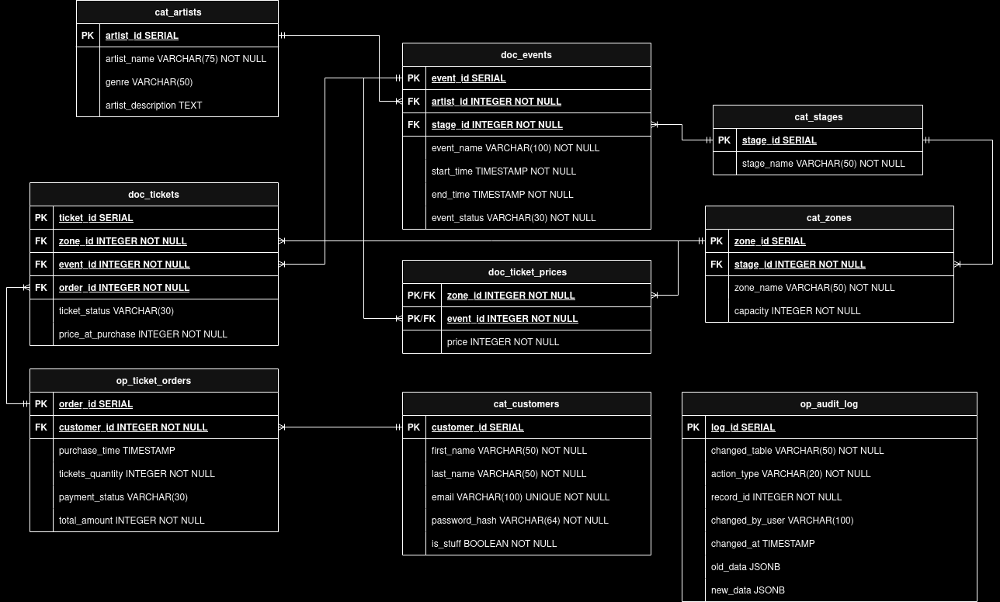
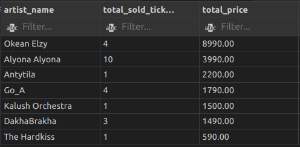
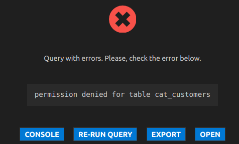
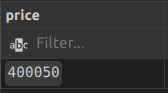
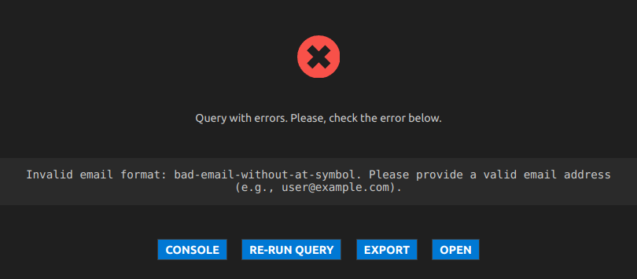
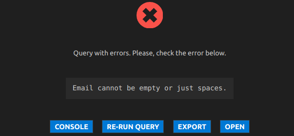

# Звіт з лабораторної роботи 5. Керування БД, оптимізація продуктивності та автоматизація

**Виконав:** Нестерук Павло
**Група:** ІПЗ-31
**Дата виконання:** 02 грудня 2025 року
**Варіант:** Система управління концертним майданчиком

## Мета роботи

Навчитися аналізувати та оптимізувати продуктивність баз даних через створення індексів та аналіз планів виконання запитів, опанувати механізми автоматизації за допомогою тригерів та представлень, освоїти базові операції адміністрування СУБД, включаючи керування правами доступу та резервне копіювання.

## Виконання роботи

### Загальна діаграма бази даних concert_place


### Рівень 1.

#### Крок 1. Проаналізувати продуктивність трьох складних запитів за допомогою команди EXPLAIN ANALYZE

1) Перший складний запит використовує велику кількість таблиць
``` sql
-- Дізнаємося інфомацію про всі куплені квитки зі статусом 'Active'
-- Та аналізуємо їх роботу
EXPLAIN (ANALYZEб)
SELECT 
    t.ticket_id, 
    e.event_name,
    z.zone_name,
    (c.first_name ||' '|| c.last_name) as client_name,
    t.ticket_status,
    CASE
        WHEN t.price_at_purchase < tp.price THEN TRUE ELSE FALSE END as is_discounted,
    t.price_at_purchase,
    tp.price as current_price

FROM doc_tickets t
JOIN doc_events e ON t.event_id = e.event_id
JOIN cat_zones z ON t.zone_id = z.zone_id
JOIN doc_ticket_prices tp ON e.event_id = tp.event_id AND z.zone_id = tp.zone_id
JOIN op_ticket_orders tord ON t.order_id = tord.order_id
JOIN cat_customers c ON tord.customer_id = c.customer_id
WHERE t.ticket_status = 'Active'
ORDER BY ticket_id;
```
Результат виконання:
```json
[
  {
    "QUERY PLAN": "Sort  (cost=12.83..12.84 rows=1 width=459) (actual time=2.264..2.311 rows=24 loops=1)"
  },
  {
    "QUERY PLAN": "  Sort Key: t.ticket_id"
  },
  {
    "QUERY PLAN": "  Sort Method: quicksort  Memory: 27kB"
  },
  {
    "QUERY PLAN": "  ->  Nested Loop  (cost=1.83..12.82 rows=1 width=459) (actual time=1.070..2.115 rows=24 loops=1)"
  },
  {
    "QUERY PLAN": "        Join Filter: (t.zone_id = z.zone_id)"
  },
  {
    "QUERY PLAN": "        ->  Nested Loop  (cost=1.68..12.61 rows=1 width=552) (actual time=1.027..1.911 rows=24 loops=1)"
  },
  {
    "QUERY PLAN": "              Join Filter: ((t.event_id = tp.event_id) AND (t.zone_id = tp.zone_id))"
  },
  {
    "QUERY PLAN": "              Rows Removed by Join Filter: 7"
  },
  {
    "QUERY PLAN": "              ->  Nested Loop  (cost=1.53..7.34 rows=1 width=552) (actual time=0.991..1.704 rows=24 loops=1)"
  },
  {
    "QUERY PLAN": "                    Join Filter: (t.event_id = e.event_id)"
  },
  {
    "QUERY PLAN": "                    Rows Removed by Join Filter: 155"
  },
  {
    "QUERY PLAN": "                    ->  Nested Loop  (cost=1.53..6.11 rows=1 width=330) (actual time=0.948..1.187 rows=24 loops=1)"
  },
  {
    "QUERY PLAN": "                          ->  Hash Join  (cost=1.39..2.56 rows=1 width=98) (actual time=0.910..0.975 rows=24 loops=1)"
  },
  {
    "QUERY PLAN": "                                Hash Cond: (tord.order_id = t.order_id)"
  },
  {
    "QUERY PLAN": "                                ->  Seq Scan on op_ticket_orders tord  (cost=0.00..1.12 rows=12 width=8) (actual time=0.736..0.750 rows=12 loops=1)"
  },
  {
    "QUERY PLAN": "                                ->  Hash  (cost=1.38..1.38 rows=1 width=98) (actual time=0.122..0.125 rows=24 loops=1)"
  },
  {
    "QUERY PLAN": "                                      Buckets: 1024  Batches: 1  Memory Usage: 10kB"
  },
  {
    "QUERY PLAN": "                                      ->  Seq Scan on doc_tickets t  (cost=0.00..1.38 rows=1 width=98) (actual time=0.026..0.059 rows=24 loops=1)"
  },
  {
    "QUERY PLAN": "                                            Filter: ((ticket_status)::text = 'Active'::text)"
  },
  {
    "QUERY PLAN": "                                            Rows Removed by Filter: 6"
  },
  {
    "QUERY PLAN": "                          ->  Index Scan using cat_customers_pkey on cat_customers c  (cost=0.14..3.49 rows=1 width=240) (actual time=0.004..0.004 rows=1 loops=24)"
  },
  {
    "QUERY PLAN": "                                Index Cond: (customer_id = tord.customer_id)"
  },
  {
    "QUERY PLAN": "                    ->  Seq Scan on doc_events e  (cost=0.00..1.10 rows=10 width=222) (actual time=0.003..0.009 rows=7 loops=24)"
  },
  {
    "QUERY PLAN": "              ->  Index Scan using doc_ticket_prices_pkey on doc_ticket_prices tp  (cost=0.15..5.13 rows=10 width=12) (actual time=0.004..0.004 rows=1 loops=24)"
  },
  {
    "QUERY PLAN": "                    Index Cond: (event_id = e.event_id)"
  },
  {
    "QUERY PLAN": "        ->  Index Scan using cat_zones_pkey on cat_zones z  (cost=0.15..0.19 rows=1 width=122) (actual time=0.004..0.004 rows=1 loops=24)"
  },
  {
    "QUERY PLAN": "              Index Cond: (zone_id = tp.zone_id)"
  },
  {
    "QUERY PLAN": "Planning Time: 8.113 ms"
  },
  {
    "QUERY PLAN": "Execution Time: 2.778 ms"
  }
]
```

2) Складність другого запиту полягає в агрегації даних та їх сортуванні
``` sql
-- Прорахувати скільки грошей приніс кожен артист, 
-- враховуючи тільки оплачені замовлення (payment_status = 'Paid')
-- і активні або використані квитки.
EXPLAIN (ANALYZE)
SELECT 
    a.artist_name,
    COUNT(t.ticket_id) AS total_sold_tickets_quantity,
    ROUND(SUM(t.price_at_purchase)::numeric / 100, 2) AS total_price
FROM cat_artists a
JOIN doc_events e ON a.artist_id = e.artist_id
JOIN doc_tickets t ON e.event_id = t.event_id
JOIN op_ticket_orders tord ON t.order_id = tord.order_id
WHERE t.ticket_status IN ('Active', 'Used') -- враховуємо тільки активні та використані (тобто теж, які були куплені)
    AND tord.payment_status = 'Paid'
GROUP BY a.artist_id
ORDER BY total_price DESC;
```
Результат виконання:
```json
[
  {
    "QUERY PLAN": "Sort  (cost=7.57..7.57 rows=1 width=212) (actual time=1.330..1.408 rows=7 loops=1)"
  },
  {
    "QUERY PLAN": "  Sort Key: (round(((sum(t.price_at_purchase))::numeric / '100'::numeric), 2)) DESC"
  },
  {
    "QUERY PLAN": "  Sort Method: quicksort  Memory: 25kB"
  },
  {
    "QUERY PLAN": "  ->  GroupAggregate  (cost=7.53..7.56 rows=1 width=212) (actual time=1.227..1.308 rows=7 loops=1)"
  },
  {
    "QUERY PLAN": "        Group Key: a.artist_id"
  },
  {
    "QUERY PLAN": "        ->  Sort  (cost=7.53..7.53 rows=1 width=180) (actual time=1.204..1.246 rows=24 loops=1)"
  },
  {
    "QUERY PLAN": "              Sort Key: a.artist_id"
  },
  {
    "QUERY PLAN": "              Sort Method: quicksort  Memory: 26kB"
  },
  {
    "QUERY PLAN": "              ->  Nested Loop  (cost=1.54..7.52 rows=1 width=180) (actual time=0.368..1.164 rows=24 loops=1)"
  },
  {
    "QUERY PLAN": "                    ->  Nested Loop  (cost=1.40..3.72 rows=1 width=12) (actual time=0.263..0.910 rows=24 loops=1)"
  },
  {
    "QUERY PLAN": "                          Join Filter: (t.order_id = tord.order_id)"
  },
  {
    "QUERY PLAN": "                          Rows Removed by Join Filter: 168"
  },
  {
    "QUERY PLAN": "                          ->  Seq Scan on op_ticket_orders tord  (cost=0.00..1.15 rows=1 width=4) (actual time=0.018..0.031 rows=8 loops=1)"
  },
  {
    "QUERY PLAN": "                                Filter: ((payment_status)::text = 'Paid'::text)"
  },
  {
    "QUERY PLAN": "                                Rows Removed by Filter: 4"
  },
  {
    "QUERY PLAN": "                          ->  Hash Join  (cost=1.40..2.55 rows=2 width=16) (actual time=0.023..0.076 rows=24 loops=8)"
  },
  {
    "QUERY PLAN": "                                Hash Cond: (e.event_id = t.event_id)"
  },
  {
    "QUERY PLAN": "                                ->  Seq Scan on doc_events e  (cost=0.00..1.10 rows=10 width=8) (actual time=0.003..0.013 rows=10 loops=8)"
  },
  {
    "QUERY PLAN": "                                ->  Hash  (cost=1.38..1.38 rows=2 width=16) (actual time=0.108..0.111 rows=24 loops=1)"
  },
  {
    "QUERY PLAN": "                                      Buckets: 1024  Batches: 1  Memory Usage: 10kB"
  },
  {
    "QUERY PLAN": "                                      ->  Seq Scan on doc_tickets t  (cost=0.00..1.38 rows=2 width=16) (actual time=0.014..0.049 rows=24 loops=1)"
  },
  {
    "QUERY PLAN": "                                            Filter: ((ticket_status)::text = ANY ('{Active,Used}'::text[]))"
  },
  {
    "QUERY PLAN": "                                            Rows Removed by Filter: 6"
  },
  {
    "QUERY PLAN": "                    ->  Index Scan using cat_artists_pkey on cat_artists a  (cost=0.14..3.76 rows=1 width=172) (actual time=0.007..0.007 rows=1 loops=24)"
  },
  {
    "QUERY PLAN": "                          Index Cond: (artist_id = e.artist_id)"
  },
  {
    "QUERY PLAN": "Planning Time: 0.570 ms"
  },
  {
    "QUERY PLAN": "Execution Time: 1.704 ms"
  }
]
```

3) Третій запит використовує велику кількість таблиць та велику кількість умов
``` sql
-- Висвітлити всі квитки конкретного користувача на майбутні події, 
-- відсортовані за датою початку концерту.
EXPLAIN (ANALYZE)
SELECT 
    t.ticket_id,
    e.event_name,
    s.stage_name,
    z.zone_name,
    e.start_time

FROM doc_tickets t
JOIN op_ticket_orders tord ON t.order_id = tord.order_id
JOIN doc_events e ON t.event_id = e.event_id
JOIN cat_stages s ON e.stage_id = s.stage_id
JOIN cat_zones z ON t.zone_id = z.zone_id AND s.stage_id = z.stage_id
WHERE tord.customer_id = 7 
    AND tord.payment_status = 'Paid' 
    AND t.ticket_status = 'Active'
    AND e.start_time > NOW()
ORDER BY e.start_time ASC
```
Результат виконання:
```json
[
  {
    "QUERY PLAN": "Sort  (cost=11.23..11.23 rows=1 width=466) (actual time=0.950..0.977 rows=10 loops=1)"
  },
  {
    "QUERY PLAN": "  Sort Key: e.start_time"
  },
  {
    "QUERY PLAN": "  Sort Method: quicksort  Memory: 26kB"
  },
  {
    "QUERY PLAN": "  ->  Nested Loop  (cost=0.43..11.22 rows=1 width=466) (actual time=0.361..0.802 rows=10 loops=1)"
  },
  {
    "QUERY PLAN": "        Join Filter: (t.event_id = e.event_id)"
  },
  {
    "QUERY PLAN": "        Rows Removed by Join Filter: 10"
  },
  {
    "QUERY PLAN": "        ->  Nested Loop  (cost=0.30..11.03 rows=1 width=252) (actual time=0.197..0.542 rows=10 loops=1)"
  },
  {
    "QUERY PLAN": "              ->  Nested Loop  (cost=0.15..10.76 rows=1 width=130) (actual time=0.171..0.452 rows=10 loops=1)"
  },
  {
    "QUERY PLAN": "                    ->  Nested Loop  (cost=0.00..2.57 rows=1 width=12) (actual time=0.132..0.346 rows=10 loops=1)"
  },
  {
    "QUERY PLAN": "                          Join Filter: (t.order_id = tord.order_id)"
  },
  {
    "QUERY PLAN": "                          Rows Removed by Join Filter: 14"
  },
  {
    "QUERY PLAN": "                          ->  Seq Scan on doc_tickets t  (cost=0.00..1.38 rows=1 width=16) (actual time=0.053..0.087 rows=24 loops=1)"
  },
  {
    "QUERY PLAN": "                                Filter: ((ticket_status)::text = 'Active'::text)"
  },
  {
    "QUERY PLAN": "                                Rows Removed by Filter: 6"
  },
  {
    "QUERY PLAN": "                          ->  Seq Scan on op_ticket_orders tord  (cost=0.00..1.18 rows=1 width=4) (actual time=0.005..0.006 rows=1 loops=24)"
  },
  {
    "QUERY PLAN": "                                Filter: ((customer_id = 7) AND ((payment_status)::text = 'Paid'::text))"
  },
  {
    "QUERY PLAN": "                                Rows Removed by Filter: 9"
  },
  {
    "QUERY PLAN": "                    ->  Index Scan using cat_zones_pkey on cat_zones z  (cost=0.15..8.17 rows=1 width=126) (actual time=0.006..0.006 rows=1 loops=10)"
  },
  {
    "QUERY PLAN": "                          Index Cond: (zone_id = t.zone_id)"
  },
  {
    "QUERY PLAN": "              ->  Index Scan using cat_stages_pkey on cat_stages s  (cost=0.15..0.26 rows=1 width=122) (actual time=0.005..0.005 rows=1 loops=10)"
  },
  {
    "QUERY PLAN": "                    Index Cond: (stage_id = z.stage_id)"
  },
  {
    "QUERY PLAN": "        ->  Index Scan using idx_events_start_time on doc_events e  (cost=0.14..0.18 rows=1 width=234) (actual time=0.018..0.020 rows=2 loops=10)"
  },
  {
    "QUERY PLAN": "              Index Cond: ((stage_id = s.stage_id) AND (start_time > now()))"
  },
  {
    "QUERY PLAN": "Planning Time: 7.519 ms"
  },
  {
    "QUERY PLAN": "Execution Time: 1.327 ms"
  }
]
```

#### Крок 2. Створити три індекси для оптимізації найбільш повільних запитів та перевірити покращення продуктивності

1)  Індексація поля customer_id в таблиці op_ticket_orders.
``` sql
CREATE INDEX idx_ticket_orders_customer_id ON op_ticket_orders(customer_id);
```
Дозволяє швидко знаходити всі замовлення конкретного користувача, так як зазвичай на одного користувача може бути багато замовлень. Корисне при наступних запитах: користувач хоче перевірити історію своїх покупок; Менеджеру потрібно підрахувати клієнта, що найбільше приносить прибуток тощо.


2) Cтворення складеного індексу для полів stage_id та start_time для таблиці doc_events
``` sql
CREATE INDEX idx_events_start_time ON doc_events(stage_id, start_time);
```
Цей індекс дозволяє оптимізувати роботу тригера check_event_time(), так як той спрацьовує при оновленні даних або при додаванні нових. Щоб перевірити, чи існують записи в подібному часовому проміжку, він шукає дані по stage_id та start_time.


3) Індексація поля order_id з таблиці doc_tickets
``` sql
-- До одного замовлення, можуть бути прикріплені декілька квитків. 
-- Для кращого пошуку по номеру замовлення, додаємо індекс на поле зовнішнього ключа order_id 
CREATE INDEX idx_ticket_order_id ON doc_tickets(order_id);
```
Таблиця doc_tickets передбачає створення декількох квитків по одному замовленню. Це оптимізує запити пов'язані з пошуком квитків по номеру замовлення (напр. для відображення на сторінці користувача).

#### Крок 3. Створити два представлення (VIEW) для спрощення доступу до часто використовуваних запитів
1) Універсальний запит для відображення розкладу подій на поточний місяць
```sql
CREATE VIEW current_month_events AS
SELECT 
    e.event_id,
    e.event_name,
    a.artist_name,
    s.stage_name,
    e.start_time,  
    e.end_time,
    STRING_AGG(z.zone_name, ' | ' ORDER BY capacity DESC) AS available_scenes
FROM doc_events e
JOIN cat_stages s ON e.stage_id = s.stage_id
JOIN cat_artists a ON e.artist_id = a.artist_id
LEFT JOIN doc_ticket_prices tp ON e.event_id = tp.event_id
LEFT JOIN cat_zones z ON tp.zone_id = z.zone_id
WHERE e.start_time >= date_trunc('month', CURRENT_DATE) 
    AND e.start_time < date_trunc('month', CURRENT_DATE + INTERVAL '1 month')
GROUP BY 
    e.event_id,
    e.event_name,
    a.artist_name,
    s.stage_name,
    e.start_time,  
    e.end_time
ORDER BY e.start_time ASC
```
Результат виконання:

Примітка: для більш кращого представлення, CURRENT_DATE було змінено на '2026-06-02'


2) Перегляд загального прибутку кожного артиста 
```sql
-- VIEW для перегляду загального прибутку кожного артиста
CREATE VIEW total_artists_profit AS
SELECT 
    a.artist_name,
    COUNT(t.ticket_id) AS total_sold_tickets_quantity,
    ROUND(SUM(t.price_at_purchase)::numeric / 100, 2) AS total_price
FROM cat_artists a
JOIN doc_events e ON a.artist_id = e.artist_id
JOIN doc_tickets t ON e.event_id = t.event_id
JOIN op_ticket_orders tord ON t.order_id = tord.order_id
WHERE t.ticket_status IN ('Active', 'Used') -- враховуємо тільки активні та використані (тобто теж, які були куплені)
    AND tord.payment_status = 'Paid'
GROUP BY a.artist_id
ORDER BY total_price DESC;
```
Результат виконання:



#### Крок 4. Розробити тригер для автоматичного логування операцій вставки або оновлення в одній з таблиць

- Було розроблено функцію log_event_changes(), що логує всі зміни (INSERT, UPDATE, DELETE) у таблиці doc_events. Для відстеження, була створена таблиця op_audit_log
``` sql
-- Таблиця для ведення логування
CREATE TABLE op_audit_log(
    log_id SERIAL PRIMARY KEY,
    changed_table VARCHAR(50) NOT NULL,
    action_type VARCHAR(20) NOT NULL,
    record_id INTEGER NOT NULL,
    changed_by_user VARCHAR(100) DEFAULT CURRENT_USER,
    changed_at TIMESTAMP DEFAULT CURRENT_TIMESTAMP,
    old_data JSONB,
    new_data JSONB
);

-- реалізація функції запису логу
CREATE OR REPLACE FUNCTION log_event_changes() 
RETURNS TRIGGER AS $$
BEGIN
    IF (TG_OP = 'INSERT') THEN
        INSERT INTO op_audit_log (changed_table, action_type, record_id, new_data)
        VALUES (TG_TABLE_NAME, 'INSERT', NEW.event_id, row_to_json(NEW)::JSONB);
    ELSIF (TG_OP = 'UPDATE') THEN
        INSERT INTO op_audit_log (changed_table, action_type, record_id, old_data, new_data)
        VALUES (TG_TABLE_NAME, 'UPDATE', NEW.event_id, row_to_json(OLD)::JSONB, row_to_json(NEW)::JSONB);
    ELSIF (TG_OP = 'DELETE') THEN
        INSERT INTO op_audit_log (changed_table, action_type, record_id, old_data)
        VALUES (TG_TABLE_NAME, 'DELETE', OLD.event_id, row_to_json(OLD)::JSONB);
    END IF;
    RETURN NULL;
END;
$$ LANGUAGE plpgsql;

-- створення тригера
CREATE TRIGGER doc_events_log_changes_trigger
AFTER INSERT OR UPDATE OR DELETE ON doc_events
FOR EACH ROW
EXECUTE FUNCTION log_event_changes();
```
- Тестування тригера 
```sql
-- ====== Тести ======
-- 1. Вставка (INSERT)
INSERT INTO doc_events (event_name, stage_id, artist_id, start_time, end_time)
VALUES ('Test Audit Concert', 1, 1, '2026-09-01 20:00', '2026-09-01 22:00');

-- 2. Оновлення (UPDATE) - змінимо час
UPDATE doc_events 
SET start_time = '2026-09-01 21:00' 
WHERE event_name = 'Test Audit Concert';

-- 3. Видалення (DELETE)
DELETE FROM doc_events 
WHERE event_name = 'Test Audit Concert';    

-- 4. Перевірка результату
SELECT * FROM op_audit_log ORDER BY log_id DESC LIMIT 3;
```

Результат виконання тестів: 
```json
[
  {
    "log_id": 20,
    "changed_table": "doc_events",
    "action_type": "DELETE",
    "record_id": 38,
    "changed_by_user": "root",
    "changed_at": "2025-12-02 19:33:47.434203",
    "old_data": {
      "end_time": "2026-09-01T22:00:00",
      "event_id": 38,
      "stage_id": 1,
      "artist_id": 1,
      "event_name": "Test Audit Concert",
      "start_time": "2026-09-01T21:00:00",
      "event_status": "Upcoming"
    },
    "new_data": null
  },
  {
    "log_id": 19,
    "changed_table": "doc_events",
    "action_type": "UPDATE",
    "record_id": 38,
    "changed_by_user": "root",
    "changed_at": "2025-12-02 19:33:44.907266",
    "old_data": {
      "end_time": "2026-09-01T22:00:00",
      "event_id": 38,
      "stage_id": 1,
      "artist_id": 1,
      "event_name": "Test Audit Concert",
      "start_time": "2026-09-01T20:00:00",
      "event_status": "Upcoming"
    },
    "new_data": {
      "end_time": "2026-09-01T22:00:00",
      "event_id": 38,
      "stage_id": 1,
      "artist_id": 1,
      "event_name": "Test Audit Concert",
      "start_time": "2026-09-01T21:00:00",
      "event_status": "Upcoming"
    }
  },
  {
    "log_id": 18,
    "changed_table": "doc_events",
    "action_type": "INSERT",
    "record_id": 38,
    "changed_by_user": "root",
    "changed_at": "2025-12-02 19:33:42.37086",
    "old_data": null,
    "new_data": {
      "end_time": "2026-09-01T22:00:00",
      "event_id": 38,
      "stage_id": 1,
      "artist_id": 1,
      "event_name": "Test Audit Concert",
      "start_time": "2026-09-01T20:00:00",
      "event_status": "Upcoming"
    }
  }
]
```

#### Крок 5. Створити нового користувача з обмеженими правами доступу до певних таблиць

- Створюємо користувача content_manager для модифікації таких таблиць: cat_artists, cat_stages, cat_zones, doc_events, doc_ticket_prices
``` sql
-- фактичне створення користувача
CREATE USER content_manager WITH PASSWORD 'secure_password_123';

-- створюємо роль content_manager та підключаємо до БД
GRANT CONNECT ON DATABASE concert_place TO content_manager;

-- надаємо права користуватися SCHEMA public
GRANT USAGE ON SCHEMA public TO content_manager;

-- фактично надаємо права на таблиці контенту
GRANT SELECT, INSERT, UPDATE, DELETE ON TABLE 
    cat_artists, 
    cat_stages, 
    cat_zones, 
    doc_events, 
    doc_ticket_prices
TO content_manager;

GRANT INSERT ON TABLE op_audit_log TO content_manager;

-- надаємо також права на SEQUENCE, щоб можна було додавати дані
-- в таблицю, де використовується, напр., SERIAL PRIMARY KEY
GRANT USAGE, SELECT ON SEQUENCE 
    cat_artists_artist_id_seq,
    cat_stages_stage_id_seq,
    cat_zones_zone_id_seq,
    doc_events_event_id_seq,
    op_audit_log_log_id_seq
TO content_manager;
```

Тестування:
```sql
-- =========== ТЕСТИ ===========
-- Змінюємо поточну роль на менеджера
SET ROLE content_manager;

-- Пробуємо подивитися артистів (Має спрацювати)
SELECT * FROM cat_artists;

-- Пробуємо додати артиста (Має спрацювати, якщо є права на Sequence)
INSERT INTO cat_artists (artist_name, genre) VALUES ('Test Band', 'Rock');

-- Пробуємо подивитися клієнтів (МАЄ БУТИ ПОМИЛКА: Permission denied)
SELECT * FROM cat_customers;

-- Повертаємося назад у роль суперюзера (root)
RESET ROLE;
```
Результат тестування:


---

### Рівень 2.

#### Крок 1. Створити складне представлення з можливістю оновлення через правила (RULES)

- Складне представлення, що дозволяє редагувати час події та ціну квитка VIP зони в одному місці за допомогою Rules
``` sql
CREATE OR REPLACE VIEW v_event_vip_pricing AS
SELECT
    e.event_id,
    e.event_name,
    e.start_time,
    ROUND((tp.price)::numeric / 100, 2) AS vip_price
FROM doc_events e
JOIN doc_ticket_prices tp ON e.event_id = tp.event_id
WHERE tp.zone_id = 3;


CREATE RULE update_event_vip_price_n_time AS
ON UPDATE TO v_event_vip_pricing
DO INSTEAD (
    UPDATE doc_events 
    SET start_time = NEW.start_time 
    WHERE event_id = OLD.event_id;
    
    UPDATE doc_ticket_prices 
    SET price = (NEW.vip_price * 100)::INTEGER 
    WHERE event_id = OLD.event_id 
        AND zone_id = 3;
);
```

- Тестування
```sql
-- ============= ТЕСТИ =============
-- 2026-06-20 20:00 | vip ticket: 3000.00 
SELECT * 
FROM v_event_vip_pricing 
WHERE event_id = 1;

-- змінюємо ціну на 4000.50
UPDATE v_event_vip_pricing
SET vip_price = 4000.50
WHERE event_id = 1;

-- перевіряємо чи ціну було змінено
SELECT price 
FROM doc_ticket_prices 
WHERE event_id = 1 
    AND zone_id = 3;
```

Результат виконання:




#### Крок 2. Реалізувати тригер для валідації даних перед вставкою з відхиленням некоректних значень

- Тригер, що перевіряє правильність введеної електронної адреси для таблиці `cat_customers`
```sql
CREATE OR REPLACE FUNCTION validate_customer_email() 
RETURNS TRIGGER AS $$
BEGIN
    -- email не повинен бути просто пробілом
    IF TRIM(NEW.email) = '' THEN
        RAISE EXCEPTION 'Email cannot be empty or just spaces.';
    END IF;

    -- перевіряємо, чи формат електронної адреси правильний за допомогою regular expression
    -- патерн: щось + @ + щось + . + щось
    IF NEW.email !~* '^[A-Za-z0-9._%+-]+@[A-Za-z0-9.-]+\.[A-Za-z]{2,}$' THEN
        RAISE EXCEPTION 'Invalid email format: %. Please provide a valid email address (e.g., user@example.com).', NEW.email;
    END IF;

    RETURN NEW;
END;
$$ LANGUAGE plpgsql;

CREATE TRIGGER check_email_format_trigger
BEFORE INSERT OR UPDATE ON cat_customers
FOR EACH ROW
EXECUTE FUNCTION validate_customer_email();
```
- Тестування
```sql
-- ====== Тести ======
-- некоректна електронна адреса
INSERT INTO cat_customers (first_name, last_name, email, password_hash)
VALUES ('Hacker', 'Test', 'bad-email-without-at-symbol', 'hash123');

-- просто пробіл замість електронної адреси (помилка)
UPDATE cat_customers 
SET email = '   ' 
WHERE customer_id = 1;

-- валідна електронна адреса (успішно)
INSERT INTO cat_customers (first_name, last_name, email, password_hash)
VALUES ('Good', 'User', 'valid.user@example.com', 'hash123');
```

Результат виконання:




#### Крок 3. Розробити систему логування змін з окремою таблицею audit_log

- Тригер для логування змін таблиць: doc_events, doc_ticket_prices, op_ticket_orders, cat_customers, cat_stages, cat_zones, cat_artists
```sql
-- використовуємо заздалегідь створену таблицю op_audit_log

-- розширимо функціонал попередньої функцію log_event_changes
-- щоб мати змогу записувати зміни не тільки для doc_events
-- але й для інших теж
CREATE OR REPLACE FUNCTION log_event_changes() 
RETURNS TRIGGER AS $$
DECLARE 
    rec_id INTEGER;
BEGIN
    IF (TG_TABLE_NAME = 'doc_events') THEN
        rec_id := COALESCE(NEW.event_id, OLD.event_id);
    
    ELSIF (TG_TABLE_NAME = 'doc_ticket_prices') THEN
        rec_id := COALESCE(NEW.event_id, OLD.event_id); 
    
    ELSIF (TG_TABLE_NAME = 'op_ticket_orders') THEN
        rec_id := COALESCE(NEW.order_id, OLD.order_id);
    
    ELSIF (TG_TABLE_NAME = 'cat_customers') THEN
        rec_id := COALESCE(NEW.customer_id, OLD.customer_id);
    
    ELSIF TG_TABLE_NAME = 'cat_stages' THEN
        rec_id := COALESCE(NEW.stage_id, OLD.stage_id);
    
    ELSIF TG_TABLE_NAME = 'cat_zones' THEN
        rec_id := COALESCE(NEW.zone_id, OLD.zone_id);
    
    ELSIF TG_TABLE_NAME = 'cat_artists' THEN
        rec_id := COALESCE(NEW.artist_id, OLD.artist_id);
    
    ELSE
        rec_id := 0; -- якщо забули додати таблицю в список
    END IF;

    IF (TG_OP = 'INSERT') THEN
        INSERT INTO op_audit_log (changed_table, action_type, record_id, new_data)
        VALUES (TG_TABLE_NAME, 'INSERT', rec_id, row_to_json(NEW)::JSONB);
    ELSIF (TG_OP = 'UPDATE') THEN
        INSERT INTO op_audit_log (changed_table, action_type, record_id, old_data, new_data)
        VALUES (TG_TABLE_NAME, 'UPDATE', rec_id, row_to_json(OLD)::JSONB, row_to_json(NEW)::JSONB);
    ELSIF (TG_OP = 'DELETE') THEN
        INSERT INTO op_audit_log (changed_table, action_type, record_id, old_data)
        VALUES (TG_TABLE_NAME, 'DELETE', rec_id, row_to_json(OLD)::JSONB);
    END IF;
    RETURN NULL;
END;
$$ LANGUAGE plpgsql;

-- тригер для doc_ticket_prices
CREATE TRIGGER doc_ticket_prices_log_trigger
AFTER INSERT OR UPDATE OR DELETE ON doc_ticket_prices
FOR EACH ROW
EXECUTE FUNCTION log_event_changes();

-- тригер для op_ticket_orders
CREATE TRIGGER op_ticket_orders_log_trigger
AFTER INSERT OR UPDATE OR DELETE ON op_ticket_orders
FOR EACH ROW
EXECUTE FUNCTION log_event_changes();

-- тригер для cat_customers
CREATE TRIGGER cat_customers_log_trigger
AFTER INSERT OR UPDATE OR DELETE ON cat_customers
FOR EACH ROW
EXECUTE FUNCTION log_event_changes();

-- тригер для cat_stages
CREATE TRIGGER cat_stages_log_trigger
AFTER INSERT OR UPDATE OR DELETE ON cat_stages
FOR EACH ROW
EXECUTE FUNCTION log_event_changes();

-- тригер для cat_zones
CREATE TRIGGER cat_zones_log_trigger
AFTER INSERT OR UPDATE OR DELETE ON cat_zones
FOR EACH ROW
EXECUTE FUNCTION log_event_changes();

-- тригер для cat_artists
CREATE TRIGGER cat_artists_log_trigger
AFTER INSERT OR UPDATE OR DELETE ON cat_artists
FOR EACH ROW
EXECUTE FUNCTION log_event_changes();
```

#### Крок 4. Створити часткові індекси для оптимізації запитів з WHERE умовами

- Складана та часткова індексація полей payment_status та purchase_time в таблиці op_ticket_orders

```sql
CREATE INDEX idx_orders_statuses
ON op_ticket_orders(payment_status, purchase_time) 
WHERE payment_status != 'Paid';
```
Часто протрібно знайти замовлення, що не були оплачені в той чи інший спосіб. Корисно для запитів, де: потрібно дізнатися неоплачені замовлення користувача; змінити статус неоплачених протягом n-діб замовлень на `'Abandoned'` тощо.

#### Крок 5. Виконати резервне копіювання бази даних командою pg_dump та відновлення з резервної копії

- Створення резервної копії через `pg_dump`
```bash
# Повне копіювання бази даних
pg_dump -U root -d concert_place -F c -f 05_backup_$(date +%Y%m%d).dump

# Копіювання в SQL формат
pg_dump -U root -d concert_place > 05_pg_dump.sql
```

- Відновлення бази даних з резервної копії
```bash
# Відновлення з резервної копії
pg_restore -U root -d concert_place 05_backup_*.dump

# Або для SQL формату
psql -U postgres -d concert_place -f 05_pg_dump.sql
```

## Висновки
У ході виконання лабораторної роботи я опанував методи адміністрування та оптимізації бази даних PostgreSQL на прикладі системи концертного майданчика. За допомогою команди `EXPLAIN ANALYZE` було проаналізовано плани виконання запитів, а їхню продуктивність підвищено шляхом створення звичайних, складених і часткових індексів. Також я реалізував механізми автоматизації та контролю цілісності через тригери для валідації та аудиту змін, спростив доступ до даних за допомогою складних представлень із правилами (`RULES`) та налаштував рольову модель безпеки разом із резервним копіюванням бази даних.

## Додаток А. Скріншоти виконання
Всі скріншоти збережено в директорії `src/` з відповідними номерами та описовими назвами.

## Додаток Б. Повний код функцій та тригерів
Всі скріншоти збережено в директорії `code/` з відповідними номерами та описовими назвами.